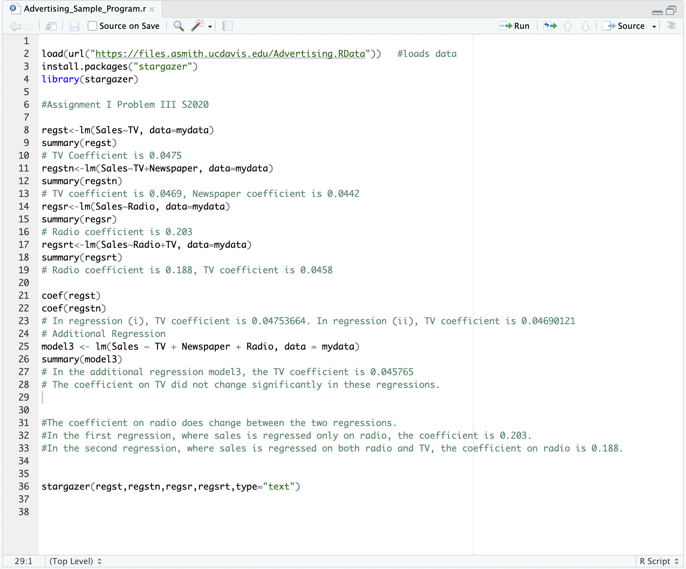

# ARE 107 Assignment 1

I. Consider the following in-class exercises:

- Exercise 2 in Lecture 2

  Decompose the Average in Group Meansl, $E[Y_i|D_i=1] - E[Y_i|D_i = 0]$, into 'Average Causal Effect' and 'Selection Bias' mathematically.

  - The 'Average Causal Effect' can be represented as: $E[Y_{1i} |D_i = 1] -E[Y_{0i}|D_i = 1]$, This represents the average difference in outcomes between the treatment group (Y1i) and the control group (Y0i) if all individuals in the population were given the treatment.
  - The 'Selection Bias' can be defined as: $E[Y_{0i}|D_i = 1] - E[Y_{0i}|Di = 0]$
  - This represents the difference in outcomes between individuals in the treatment group and the control group who would have received the treatment if they were assigned to the treatment group. This bias arises due to the nonrandom assignment of individuals to the treatment group.
  - Therefore, the difference in group means can be written as: 

  - $E[Y_i|D_i=1] - E[Y_i|D_i = 0]$ = Average Causal Effect for Di = 1 + Selection Bias
  - $= E[Y_{1i} |D_i = 1] -E[Y_{0i}|D_i = 1]+ E[Y_{0i}|D_i = 1] - E[Y_0i|Di = 0]$
  - $= E[Y_{1i} - Y_{0i}|D_i = 1] + E[Y_{0i}|D_i = 1] - E[Y_{0i}|Di = 0]$

- Exercise 2 in Lecture 3

  In the linear model, β is the causal effect for an individual. 

  Now decompose the difference in group means, E [Yi |Di = 1] −E [Yi |Di = 0], into the average causal effect and selection bias for the linear regression model.

  - The average causal effect can be represented as: ACE = β
  - The selection bias can be represented as: E(ui | Di = 1) - E(ui | Di = 0)
  - Therefore, the difference in group means can be written as: E [Yi |Di = 1] −E [Yi |Di = 0] = β + E(Y0i | Di = 1) - E(Y0i | Di = 0)

- Exercise 3 in Lecture 3
  Consider the example of earnings (Y ) and years of schooling (X)
  Yi = α + βXi + ui
  β is the causal effect of a unit change in X .
  What is the causal effect for individual i of changing schooling from 11 to 12, 15 to 16, and 17 to 18?

  - It is the causal effect of a unit change in X on individual i's earnings. Therefore, regardless of the change in schooling from 11 to 12, 15 to 16, and 17 to 18, the causal effect will be the same, which is β.

- Exercise 5 in Lecrure 4

  Decompose βOLS into β, the causal effect, and selection bias.

  - To decompose βOLS, the OLS estimator for the coefficient β, into the true causal effect (β) and the selection bias, we can use the formula:

    $β_{OLS} = β + \frac{Cov(Xi, ui)}{Var(Xi)}$

    Where:

    - β is the causal effect of a unit change in X on Y, representing the true relationship between the predictor variable and outcome variable.
    - Selection bias is the deviation of the OLS estimator from the true causal effect, it is defined as the ratio of the covariance of Xi and ui to the variance of Xi.

II. Table 1.5 in Mastering ‘Metrics presents the results for different outcomes from the Oregon Health Plan experiment.
(a) Explain in words the estimates presented in columns (1)-(4).

- Column 1 in the table represents the mean outcome for the control group in the Oregon Health Plan experiment. This is the average outcome for individuals who did not receive the treatment.

  Column 2 in the table represents the treatment effect on the control group in Oregon. This is the difference in the outcome between the treatment group and the control group among individuals who received the treatment in Oregon.

  Column 3 in the table represents the mean outcome for the control group in Portland. This is the average outcome for individuals who did not receive the treatment in Portland.

  Column 4 in the table represents the treatment effect in Portland. This is the difference in the outcome between the treatment group and the control group among individuals who received the treatment in Portland.

  These columns are used to show the effect of the treatment on different subgroups of the population and how it compares to the overall population.

(b) Which of the following terms correspond correctly to estimates presented in columns (1)-(4) given an outcome Yi,

- Column 1 corresponds to $\bar{Y0}$, which is the average outcome for individuals in the control group (those who did not receive the treatment).

  Column 2 corresponds to $\bar{Y1}-\bar{Y0}$, which is the difference in the outcome between the treatment group and the control group among individuals who received the treatment.

  Column 3 corresponds to $\bar{Y0}$, which is the average outcome for individuals in the control group (those who did not receive the treatment) in Portland.

  Column 4 corresponds to $\bar{Y1}-\bar{Y0}$, which is the difference in the outcome between the treatment group and the control group among individuals who received the treatment in Portland.

(c) For each outcome presented in the table, conduct a 5% t-test of the significance of its average treatment effect, i.e. a t-test of the null hypothesis, H0: $ E[Y1i-Y0i|Di=1]=0$

- The difference of "Ever on Medicaid" between Treatment group and control group is statistically significant since $0.256/0.004 > 1.96$. And in Portland area is $0.247/0.006 > 1.96$
- The difference of "Any hospital admissions" between Treatment group and control group is statistically significant since $0.005/0.002 > 1.96$.
- The difference of "Any emergency department visit" in Portland area between Treatment group and control group is statistically significant since $0.017/0.006 > 1.96$
- The difference of "Number of emergency department visits" in Portland area between Treatment group and control group is statistically significant since $0.101/0.029 > 1.96$
- The difference between "Outpatient visits(in the past 6 months)" between Treatment group and control group is statistically significant since $0.314/0.054 > 1.96$
- The difference between "Any prescriptions2" between Treatment group and control group is statistically significant since $0.025/0.008 > 1.96$

III. Using the “Advertising” dataset, which consists of data on sales of computers in different locations as well as advertising spending on TV, radio and newspaper. Run the sample R program (“Advertising Sample Program”) provided to you on canvas.
(a) Perform the following regressions:

(i) regress Sales on TV,

- TV Coefficient is 0.0475

(ii) regress Sales on TV and Newspaper,

- The coefficient between Sales and TV/Newspaper are 0.0469 and 0.0442 respectively

(iii) regress Sales on Radio

- The coefficient betweeen Sales and Radio is 0.203

(iv) regress Sales on Radio, TV.

- The coefficient between Sales and Radio/TV are 0.188 and 0.0458 respectively.

(b) Does the coefficient on TV change in regressions (i)-(ii)? Explain in detail why or why
not. Perform any additional regressions to support your reasoning.

- When a new variable, such as newspaper, is added to a regression, it can affect the coefficients of the other variables already in the model. In this case, the coefficient of TV in the second regression (0.047) is slightly smaller than in the first regression (0.048), but the difference is small. This is likely due to the fact that TV and newspaper are correlated, and newspaper is able to explain some of the variation in sales that is also explained by TV. However, since the correlation is not perfect, the coefficient of TV does not change by a large amount. 

(c) Does the coefficient on Radio change in regressions (iii)-(iv)? Explain in detail why or
why not. Perform any additional regressions to support your reasoning.

- The coefficient on radio does change between the two regressions. In the first regression, where sales is regressed only on radio, the coefficient is 0.203. In the second regression, where sales is regressed on both radio and TV, the coefficient on radio is 0.188.

  This change in coefficient can be explained by the fact that radio and TV are correlated. When TV is added to the regression, it can explain some of the variation in sales that was previously attributed to radio. This leads to a decrease in the coefficient on radio in the second regression.

|                  | Sorghum-Sun                | Sorghum-shade              |
| ---------------- | -------------------------- | -------------------------- |
| Light Conditions | Stem Length/P_fr:P_r Ratio | Stem Length/P_fr:P_r Ratio |
| Sun              | 50 cm/ 1.7                 | 50 cm / 1.7                |
| Shade            | 150 cm / 0.5               | 90 cm / 1.1                |

