### Lecture 1 1/9

##### Syllabus

In this course

- Design Combinational Circuits

- Design Sequential Circuits
- Caching

Cheating

- Plagiarizing/Copying code
- Search for solutions online
- GitHub Copilot or GPT-3
- trick the autograder

Share your code

- Post to GitHub as private and GitFront to generate a link

Office Hour begins next week, prof will be first week.

Lectures will be recorded. Last two year's recording is on Canvas.

Start early on the assignment.

###### Midterm is going to be a quiz on Canvas and Final is a project

Post questions on **Campuswire**. If involve code post privately.

**Groups**

- Two types of group. Study group and Homework group
  - Study group: pick by professor. Talk 20 mins per week. Do whatever.
  - Homework group: pick by self. Two person only. Could be change in other assignments.
    - responsible for group member's cheating. Partner is optional
    - group on extra credit

# Lecture 2 Noise Margins and Transistors 1/11/2023

|                       |      | Driver         | Receiver       |                      |
| --------------------- | ---- | -------------- | -------------- | -------------------- |
| VDD                   | 20   | Logical 1      | Logical 1      |                      |
|                       | 19   | Logical 1      | Logical 1      |                      |
|                       | 18   | Logical 1      | Logical 1      |                      |
|                       | 17   | Logical 1      | Logical 1      |                      |
| $V_{OH}$ (V out high) | 16   | Logical 1      | Logical 1      |                      |
|                       | 15   |                | Logical 1      |                      |
|                       | 14   |                | Logical 1      |                      |
|                       | 13   |                | Logical 1      | $V_{IH}$ (V in high) |
|                       | 12   | Forbidden Zone | Forbidden Zone |                      |
|                       | 11   | Forbidden Zone | Forbidden Zone |                      |
|                       | 10   | Forbidden Zone | Forbidden Zone |                      |
|                       | 9    | Forbidden Zone | Forbidden Zone |                      |
|                       | 8    | Forbidden Zone | Forbidden Zone |                      |
|                       | 7    |                | Logical 0      | $V_{IL}$ (V in low)  |
|                       | 6    |                | Logical 0      |                      |
|                       | 5    |                | Logical 0      |                      |
| $V_{OL}$ (V Out Low)  | 4    | Logical 0      | Logical 0      |                      |
|                       | 3    | Logical 0      | Logical 0      |                      |
|                       | 2    | Logical 0      | Logical 0      |                      |
|                       | 1    | Logical 0      | Logical 0      |                      |
| Ground                | 0    | Logical 0      | Logical 0      |                      |

$NML$ (Noise Margin Low) = 7- 4 = 3

$NMH$ (Noise Margin High) = 16-13 = 3

$NM$ (Noise Margin) = minimum of NML and NMH = 3

##### How do we change our circuits to get rid of forbidden zone?

- VIH and VIL be the same?

|                       |      | Driver    | Receiver  |                      |
| --------------------- | ---- | --------- | --------- | -------------------- |
| VDD                   | 20   | Logical 1 | Logical 1 |                      |
|                       | 19   | Logical 1 | Logical 1 |                      |
|                       | 18   | Logical 1 | Logical 1 |                      |
|                       | 17   | Logical 1 | Logical 1 |                      |
| $V_{OH}$ (V out high) | 16   | Logical 1 | Logical 1 |                      |
|                       | 15   |           | Logical 1 |                      |
|                       | 14   |           | Logical 1 |                      |
|                       | 13   |           | Logical 1 |                      |
|                       | 12   |           | Logical 1 |                      |
|                       | 11   |           | Logical 1 | $V_{IH}$ (V in high) |
|                       | 10   |           | Logical 0 | $V_{IL}$ (V in low)  |
|                       | 9    |           | Logical 0 |                      |
|                       | 8    |           | Logical 0 |                      |
|                       | 7    |           | Logical 0 |                      |
|                       | 6    |           | Logical 0 |                      |
|                       | 5    |           | Logical 0 |                      |
| $V_{OL}$ (V Out Low)  | 4    | Logical 0 | Logical 0 |                      |
|                       | 3    | Logical 0 | Logical 0 |                      |
|                       | 2    | Logical 0 | Logical 0 |                      |
|                       | 1    | Logical 0 | Logical 0 |                      |
| Ground                | 0    | Logical 0 | Logical 0 |                      |

$NML$ = 11- 4 = 7

$NMH$ = 16-11 = 5

$NM$ = 5

Noise Margin = 5

Forbbiden zone is not exists anymore. Driver did not use the all of the power. Therefore we have large noise margin and smaller forbidden zone.

##### What would we motivate us to reduce the noise margin?

- We want to maximize profits. Driver taking full advantage of the range.

##### What about minimize forbidden zone?

- We want maximize the amount of noise margin we can tolerate in the circuits.

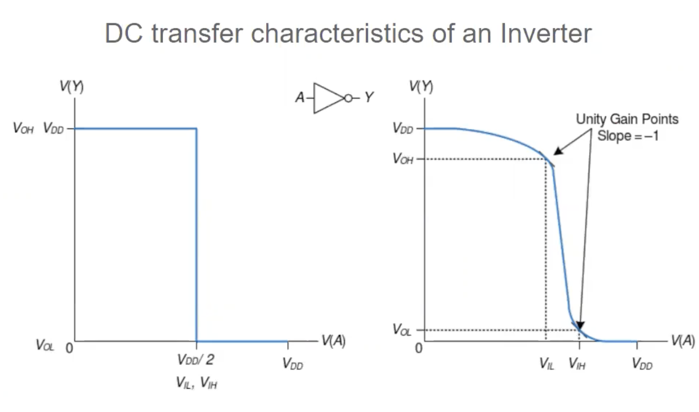

Why are we picking the unity gain points?

- Gave you max noise margin

This graph is a NOT gate

- 0 to $V_{IL}$  = $V_{OH}$ to $V_{DD}$
- $V_{IH}$ to $V_{DD}$ = $V_{OL}$ to 0

### Transistors（晶体管）

- Trnasistors were the tech breathrough that made modern computers possible

- Transistors behave like switches but are purely elctrical (no moving parts)

- They are formed by embedding negative/positive areas in a positive/negative material

- Two types of transistors

  - nMOS  （nMOS has little bubble）
  - pMOS

- MOS = Metal Oxide Semiconductor

  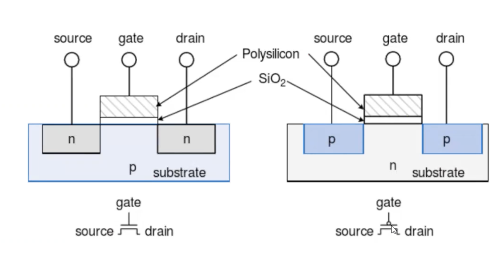

How they work

- nMOS
  - Substrate（基底） is connected to ground
  - When the gate is also connected to ground there is no electrical difference between the gate and the substrate so nothing happens and the source（源极） and drain（漏极） are disconnected
  - When a positive voltage is applied to the gate it attracts electrons from the substrate making the top part of the substrate behave like it is negatively charged
  - This creates a connection between the source and the drain and current flows
- pMOS works opposite of nMOS

Behavior - nMOS

- When you apply 0, source and drain **disconnected**, no current flow **OFF**
- When you apply 1, source and drain are **connected** and current flows between them.

pMOS

- When you apply 0, the source and drain are connected.

- When you apply 1, the source and drain are disconnected.

  

##### Building Gates with Transistors

- nMOS transistors are good at passing 0 but bad at passing 1
- pMOS transistors are good at passing 1 but bad at passing 0

- We can use both together when building gates so that we only use them in their good mode.

  - These called CMOS. C = Complimentary
  - 

- Not Gate using CMOS

  

  - 0 -> NMOS = Disconnected

  - 0 -> pMOS = Connected

    

`When you building a CMOS, you always have both nMOS and pMOS. pMOS always pass the 1 and nMOS always passing the 0` 

但是在上个example NOT Gate里面有时传0有时传1？？

- nMOS passing the ground (0), pMOS passing the power (1). 不是INPUT

What if only connected to one MOS (only pMOS)?

- It outputs undefined.

##### Using Transistors building NAND Gate

| A    | B    | Output |
| ---- | ---- | ------ |
| 0    | 0    | 1      |
| 0    | 1    | 1      |
| 1    | 0    | 1      |
| 1    | 1    | 0      |

# Lecture 3 Transistors, Power, Minterms, Maxterms (01-13-2023)

- Transistors: Connected / Disconnected
- Transistors: put in series or parallel.
- **NOR Gate**

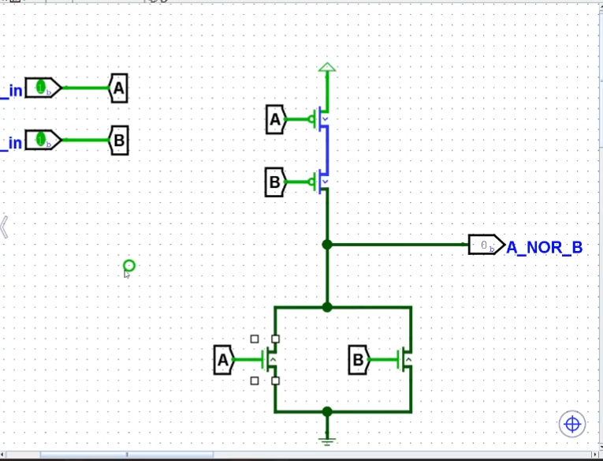

| A    | B    | Output |
| ---- | ---- | ------ |
| 0    | 0    | 1      |
| 0    | 1    | 0      |
| 1    | 0    | 0      |
| 1    | 1    | 0      |

**NOR** Gate -  Opposite of OR Gate

- A NAND Gate circuits + a NOT Gate circuits = a AND Gate Circuits

#### Power Consumption

- Circuits consume both dynamic and static power
- Dynamic power is the energy used to charge a transistor to change its from 0 to 1
- Static power is the energy used just from having the system on
  - Power is used because the transistors aren’t perfect switches and so leak a small amount of current

- If a transistor has C capacitance and switches between a 0 and 1 at frequency f than the dynamic usage power is
  - $P_{Dynmaic} = 0.5*C * f * V_{DD}^2$
  - The 0.5 is there because it only costs energy to charge the transistor (change value from 0 to 1.
    - Discharging the transistor (1 to 0) is Free
- If $I_{DD}$ is the leakage current then 
  - $P_{Static} = I_{DD} * V_{DD}$
- Total power consumed
  - $P_{Total} = P_{Dyanamic} + P_{Static}$

`这些公式用来表示动态功耗和静态功耗，以及它们之和总功耗，通过它可以估算出一个电路的功耗。`

`Watts | J/seconds`

Example:

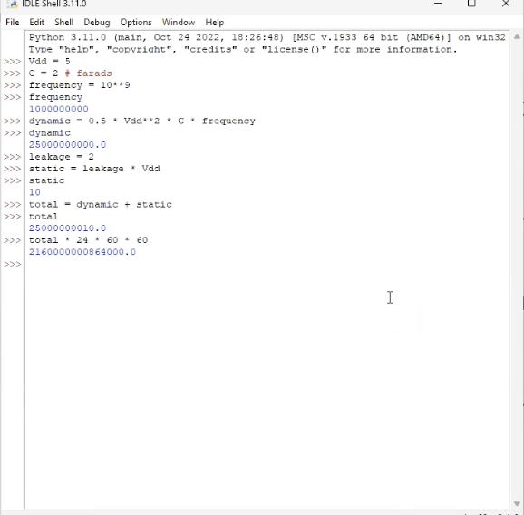

- 单位units：

  | Capacitance | Farads                |
  | ----------- | --------------------- |
  | Current     | Amps                  |
  | Frequency   | Hertz                 |
  | Power       | Watts \| Jouls/second |
  | Voltage     | Volts                 |

  **Chapter 1 finished**

### Chapter 2 Combinational Circuits

What are combinational Circuits?

- Combinational circuits are circuits where the output depends solely on the input
- Due to this fact, all combinational circuits can be described using Boolean equations
  - You should remember from your discrete logic course that any Boolean equation can be represented using a truth table
  - This means that a circuit, its corresponding Boolean equation, and its corresponding truth table are all equivalent and each one can be converted to the other 

Some Terminology

- A variable or its complement is called a literal
- An ANDing of two or more literals is called a product
  - A product involving all of the literals in a function is called a **minterm**
- An ORing of two or more literals is called a sum
  - A sum involving all of the literals in a function is called a **maxterm**
- Assume our function has 3 inputs A, B, and C
- A, ~A, B, ~B, C, and ~C are all **literals**

- 、

`minterms/maxterms because they use all of 3 inputs`

Truth Tables and Minterms/Maxterms

`Only the minterms row will output 1, on every other row output would be 0`

`only the maxterm row will output 0, on every other row output would be 1`

How to find the minterm/materm for a row

- Minterms
  - If the literal is 1 it will be the positive form or the literal
    -  (A, B, C, etc)
  - If the literal is 0 it will be the complementary form of the variable
    - (~A, ~B, ~C, etc)
- Maxterms
  - If the literal is 1 it will be the complementary form of the variable
    - (~A, ~B, ~C, etc)
  - If the literal is 0 it will be the positive form or the literal 
    - (A, B, C, etc)
- If you read the binary of the input as an unsigned number it gives you the row number
- If you have the minterm/maxterm number converting it to binary will tell you where the 1’s and 0’s are at

Example:

A	B	C	D	m12						M12

convert 12 to binary, for m12 would be

1	1	0	0	$A*B*\bar C*\bar D$	$\bar A+ \bar B +C+D$

for m10/M10

1	0	1	0	$A*\bar B* C*\bar D$	$\bar{A} + B+\bar C + D$

for m15

1	1	1	1	$ABCD$

for $\bar A + B+\bar C + \bar D$

1	0	1	1

8	4	2	1 = 11  So M11

Deriving equations from Truth Tables

- As can be seen from the previous slide
  - A minterm is True for exactly one row
  - A maxterm is False for exactly one row
- If we select the rows of output that are True and OR the corresponding **minterms** for those rows we will get an equation that describes the truth table
  - This is called Sum of Products (SOP) canonical form
- Alternatively, if we select the rows that are False and AND the corresponding **maxterms** for those rows we will also get an equation that describes the truth table
  - This is called Product of Sums (POS) canonical form

# Lecture 4 How to use Logism (01-18-2023)

##### Deriving equations from Truth Tables Example 1

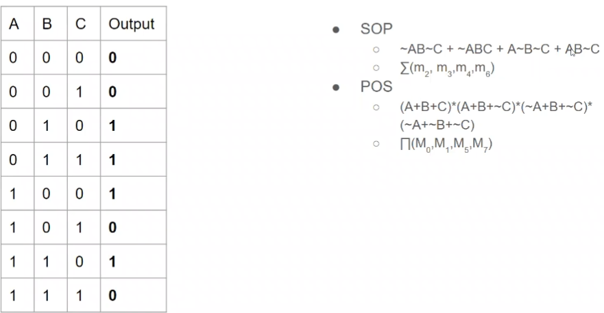

##### Deriving equations from Truth Tables Example 2

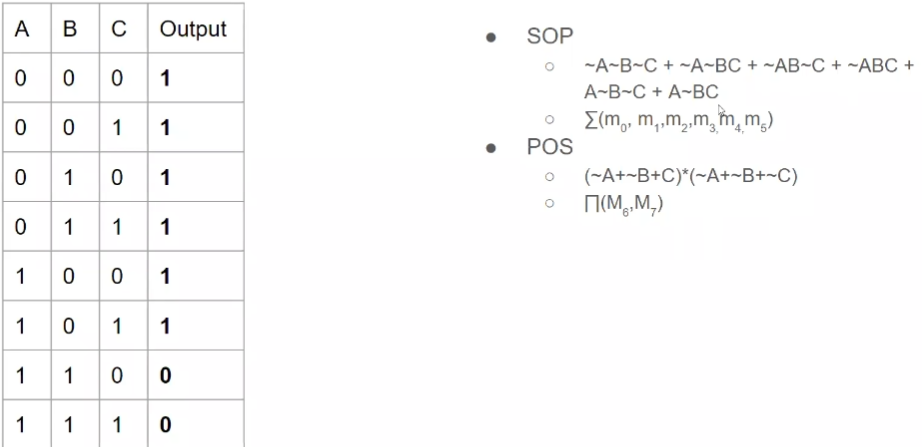

##### From Equation to Circuit

- Once you have the equation creating the circuit is straight forward
  - Negation is a NOT gate, A product is an AND gate and a sum an OR gate、
- The canonical equations will produce two levels of logic
  - SOP: multiple AND gates (one for each product) feed into an OR gate
  - POS: multiple OR gates (one for each sum) feed into an AND gate

# Lecture 5 How to Use Logisim, Boolean Algebra (01-20-2023)

- Probe: Act like print statement
- Splitter: 
- Power: always 1
- Ground: always 0
- Data bits:
- Tunnel: act like local function
- Break one big main circuits to subcircuits
- Use tunnels instead of circuits every where.

Example: Truth Table

| A    | B    | Out1 | Out2 |
| ---- | ---- | ---- | ---- |
| 0    | 0    | 0    | 1    |
| 0    | 1    | 1    | 0    |
| 1    | 0    | 1    | 1    |
| 1    | 1    | 1    | 1    |

`This is two separate equations, implement separately. Treat them in two subcircuits and maybe use splitter to final output.`

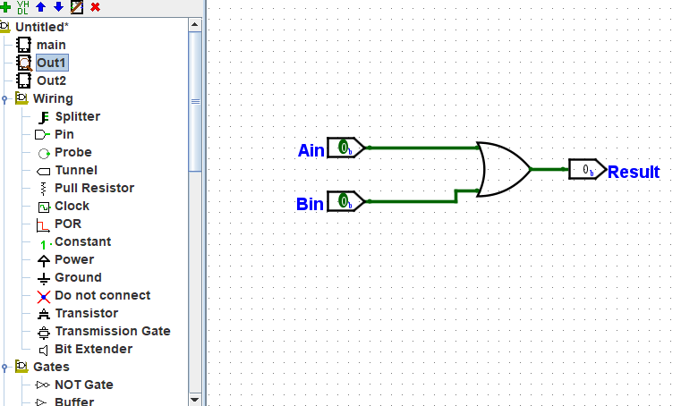

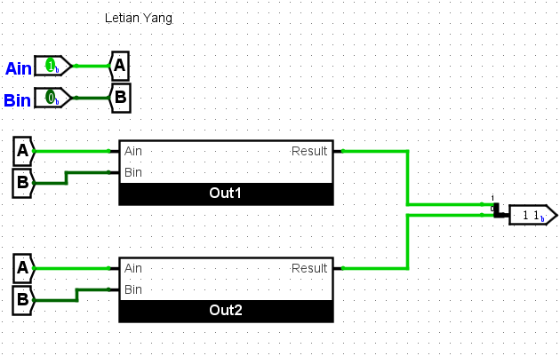

##### The desire for Simplicity

- The circuits created using the previous method are rarely the simplest circuits that solve the problem
- We want simpler circuits because
  - Simpler circuits use fewer gates and fewer gates means
    - Lower fabrication costs
    - Potentially faster circuits
    - Lower power usage
  - They can be easier to understand
- We need to learn some Boolean Algebra in order to be able to simplify functions

##### Boolean Algebra - Axioms

| Axiom             | Dual              | Name         |
| ----------------- | ----------------- | ------------ |
| B = 0 if B != 1   | B = 1 if B != 0   | Binary Field |
| ~0 = 1            | ~1 = 0            | NOT          |
| 0 * 0 = 0         | 1 + 1 = 1         | AND/OR       |
| 1 * 1 = 1         | 0 + 0 = 0         | AND/OR       |
| 0 * 1 = 1 * 0 = 0 | 1 + 0 = 0 + 1 = 1 | AND/OR       |

##### Boolean Algebra - Theorems of 1 Variable

| Theorem          | Dual          | Name            |
| ---------------- | ------------- | --------------- |
| B * 1 = B        | B + 0 = B     | Identity        |
| B * 0 = 0        | B + 1 = 1     | Null Element    |
| **B \* B = B**   | **B + B = B** | **Idempotency** |
| ~${\bar{B}}$ = B |               | Involution      |
| **B*~B = 0**     | **B+~B = 1**  | **Complements** |

##### Boolean Algebra - Theorems of Multiple Variables

##### Proving Equivalence

- You can show that two Boolean equations are equivalent by either
  - Showing that their truth tables are the same
    - This is called perfect induction
  - Using Boolean Algebra to transform the equations until they are the same
- Note that to show that two equations are **not** equivalent you should show that their truth tables are not the same
  - Boolean Algebra cannot be used to show inequivalence 

##### Prove the Covering theorem

#####   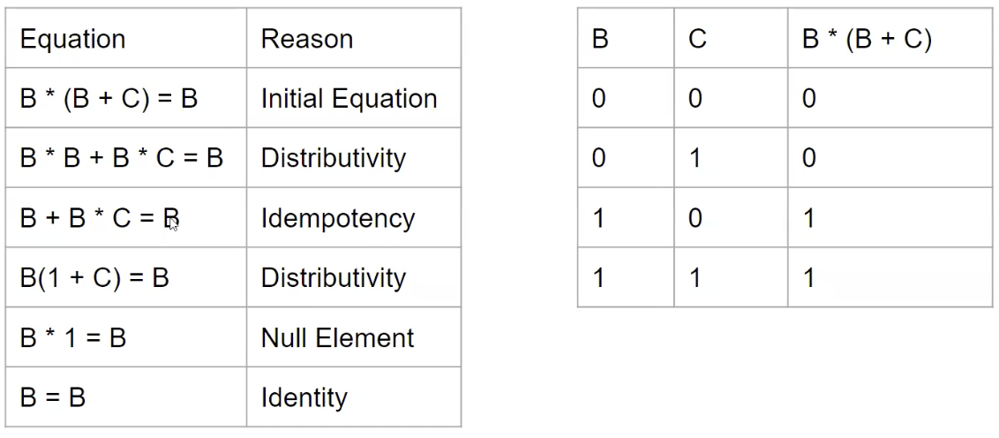

##### Prove the Combining Theory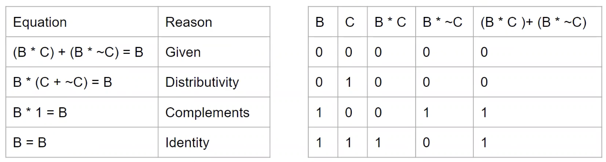

## [KMaps (Lecture 01-23-2023)](https://video.ucdavis.edu/media/ECS154ALecture01-23-2023/1_q2kjnjje)

##### Simplify Equation Example 1

- 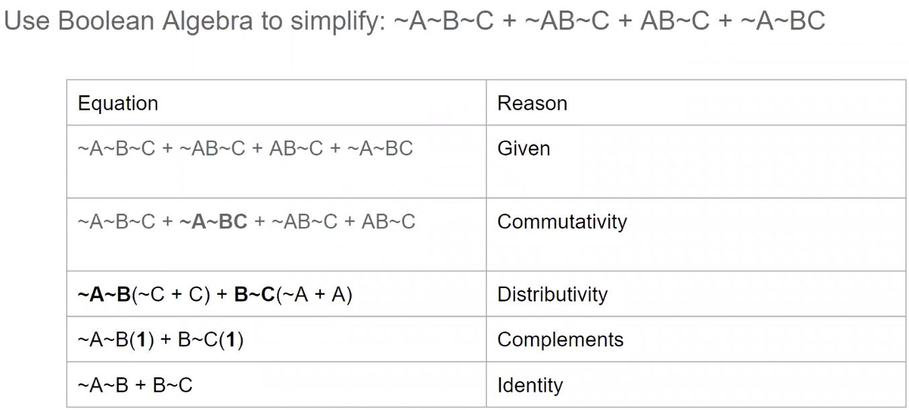

##### Simplify Equation Example 2

- Use Boolean algebra to simiplify:
  - `~A~B~C + ~AB~C + AB~C + A~B~C + ~A~BC + A~BC`
    - `~C(~A~B+~AB+AB+A~B)+~BC(~A+A)`
    - `~C(~A(~B+B)+A(B+~B)+~BC(1)`
    - `~C(~A(1)+A(1))+~BC`
    - `~C(1)+~BC`
    - `~C+~BC`
  - However, this answer is wrong. It is not simplist.
  - It could be simplify to `~C+~B`
    - 
  - Problem is we never know if using Boolean algebra rule we could reduce the simplest form.

##### Karnaugh - Maps

- Boolean Algebra is hard to do right consistently
  - I always have trouble myself knowing if I’ve gotten things as simple as possible with it
- K-maps give you an easy way to spot the reductions you need to do by placing terms that need to be combined next to each other in a grid
- Rules
  - Elements in adjacent squares can only differ by 1 bit
  - The ends “wrap around” because they are only single variable apart
  - Circle the largest power of 2 of 1’s for SOP or 0’s for POS
  - Use the fewest circles possible to circle all the 1’s if doing SOP or 0’s if doing POS
  - If the value of a variable changes across the circling you eliminate it

##### 2 Variable K-Map

Truth Table

| A    | B    | Out  |
| ---- | ---- | ---- |
| 0    | 0    | Out0 |
| 0    | 1    | Out1 |
| 1    | 0    | Out2 |
| 1    | 1    | Out3 |

K-Map

| A/B  | 0    | 1    |
| ---- | ---- | ---- |
| 0    | Out0 | Out2 |
| 1    | Out1 | Out3 |

##### 2 Variable K-Map - Example

- Find the simplest expression that represents this truth table:
| A    | B    | Out  |
| ---- | ---- | ---- |
| 0    | 0    | 0    |
| 0    | 1    | 0    |
| 1    | 0    | 1    |
| 1    | 1    | 1    |

- K-Map:

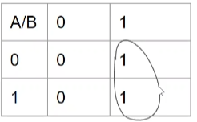

- Simplest form is A

##### 2 Variable K-Map - Example

- Find the simplest expression that represents this truth table:
| A    | B    | Out  |
| ---- | ---- | ---- |
| 0    | 0    | 0    |
| 0    | 1    | 1    |
| 1    | 0    | 1    |
| 1    | 1    | 0    |

K-Map:

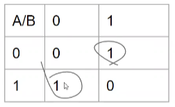

- Simplest form is `A~B+~AB`
- Can't circle diagonally so there are two circles of 1

##### 3 Variable K-Map

Truth Table:

| A    | B    | C    | Out  |
| ---- | ---- | ---- | ---- |
| 0    | 0    | 0    | Out0 |
| 0    | 0    | 1    | Out1 |
| 0    | 1    | 0    | Out2 |
| 0    | 1    | 1    | Out3 |
| 1    | 0    | 0    | Out4 |
| 1    | 0    | 1    | Out5 |
| 1    | 1    | 0    | Out6 |
| 1    | 1    | 1    | Out7 |

K-Map:

| AB/C | 00   | 01   | 11   | 10   |
| ---- | ---- | ---- | ---- | ---- |
| 0    | Out0 | Out2 | Out6 | Out4 |
| 1    | Out1 | Out3 | Out7 | Out5 |

##### 3 Variable K-Map - Example

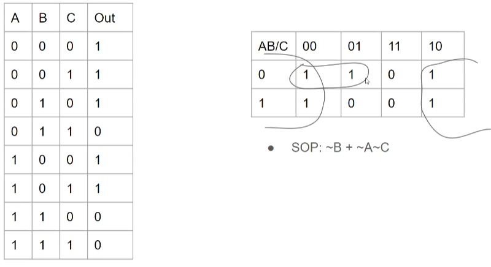

- SOP Way: B stays the same. A and C stays the same. Since they are stay 0 and we circle 1, we negate these two.

- POS Way:

  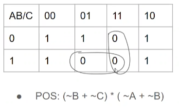

  - B and C stay the same and A and B stay the same in circles. But since they are 1 and we circle 0, we negate them.

- Fewer circles always wins. 4-variable circles wins 2 variable circles.

##### 3 Variable K-Map - Example 2 - SOP 

- B and C stays same (when they are 0). A and B stays same. B and C stays same.

##### 3 Variable K-Map - Example 2 - POS 

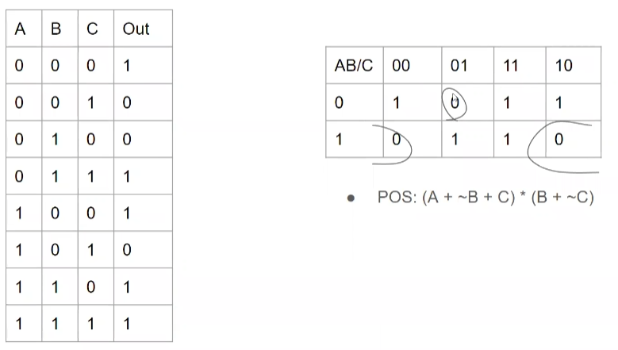

- POS is better since it only has 2 circles. less than 3 circles.

- 总结：圈里不一样的忽略，一样的拿出来。SOP（圈1）POS (圈0)。只能power of 2(1,2,4,8,16...)

##### 4 Variable K-map

- For 4 Variable K-maps their corners are also a valid circling as they differ by only a single bit

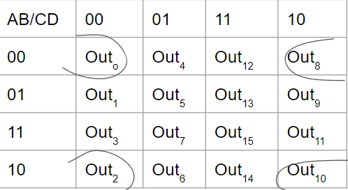

##### 4 Variable K-map - Example 1 - SOP

- Find the simplest SOP equation for this K-Map

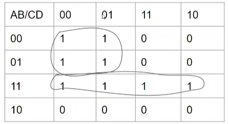

- `(~A * ~C)+(C * D)`

##### 4 Variable K-map - Example 1 - POS

- 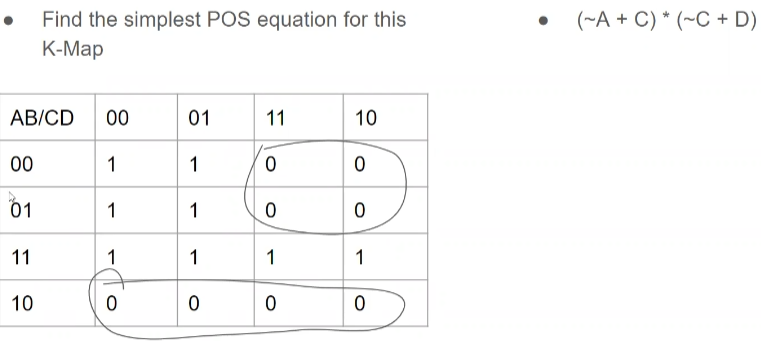

##### 4 Variable K-map - Example 2 - SOP

## [KMaps (Discussion 01-23-2023)](https://video.ucdavis.edu/media/ECS154ADiscussion01-23-2023/1_b2zd9axs)

- Review: Circle all the one for SOP, or all the zero for POS. cannot be irregularly shape. Use fewest circle possible. Single bit change adjacent cells.

##### 5 Variable K-maps

- With 5 Variable K-Maps we lay two 4 variable Kmaps on top of each other

- In one of the Kmaps we hold a variable constant

- We can now circle through the K-Maps since they are on top of each other

  A = 0

| BC/DE | 00   | 01   | 11    | 10    |
| ----- | ---- | ---- | ----- | ----- |
| 00    | Out0 | Out4 | Out12 | Out8  |
| 01    | Out1 | Out5 | Out13 | Out9  |
| 11    | Out3 | Out7 | Out15 | Out11 |
| 10    | Out2 | Out6 | Out14 | Out10 |
​		A = 1

| BC/DE | 00    | 01    | 11    | 10    |
| ----- | ----- | ----- | ----- | ----- |
| 00    | Out16 | Out20 | Out28 | Out24 |
| 01    | Out17 | Out21 | Out29 | Out25 |
| 11    | Out19 | Out23 | Out31 | Out27 |
| 10    | Out18 | Out22 | Out30 | Out26 |

##### 5 Variable K-maps - Example - SOP

- Find the simplest SOP Equation for the given K-Map
- The highlighted areas mean the circle goes through to the other K-map
- 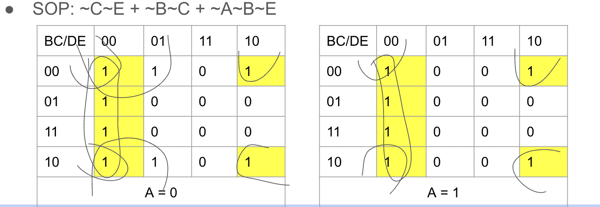

  ​	

##### Don't Cares

- Sometimes when we are designing a circuit for a problem there may be outputs where we don’t care what the value will be
  - Generally this comes from having inputs that are illegal or nonsensical
- We can use these don’t cares to our advantage to create larger circles in our K-maps and therefore simpler circuits
  - We will mark don’t cares with d’s in our class
- We circle the d’s if they make our circle of 1’s/0’s larger than they could be without them
  - The d’s don’t have to be circled if they don’t make a circle larger or don’t contain at least 1 or 0
  - If given the choice of two circles of the same size, prefer the one that contains more 1’s/0’s

##### 4 Variable K-map - Example 1 with Don’t Cares

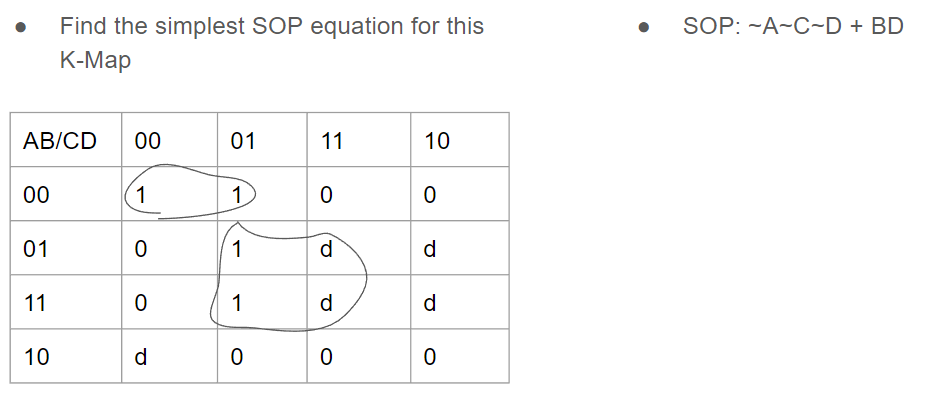

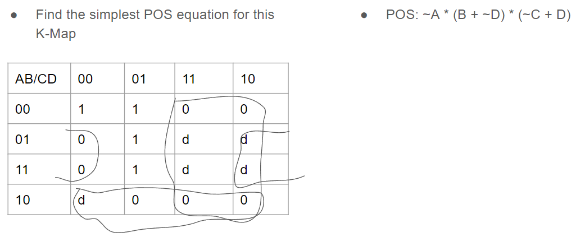

##### K-Map Practice

## [Kmap Examples, Start Boolean Algebra Kmap Connection (Lecture 01-25-2023)](https://video.ucdavis.edu/media/ECS154ALecture01-25-2023/1_2qtgky86)

...

## [Boolean Algebra Kmap Connection, Start Timing (Lecture 01-27-2023)](https://video.ucdavis.edu/media/ECS154ALecture01-27-2023/1_amkxzf5m)

Start from Timing 41:26

##### Timing

- As we saw before the output of a gate doesn’t change instantly when we change an input, so how long must we wait before we know our output is good?
- Propagation delay 传播延迟
  - The minimum amount of time it takes after an input changes before the output becomes stable
  - AKA worst case, longest, or critical path through a circuit
- Contamination delay 污染延迟
  - Minimum amount of time after an input changes before any output changes
  - AKA Shortest path through a circuit
- To find the propagation delay through a circuit
  - Write the propagation delay of each gate above it
  - Take the **maximum** delay coming into a gate and add the gate’s propagation delay to get the output delay
  - Inputs to the circuit have 0 delay
- To find contamination delay
  - Write the contamination delay of each gate above it
  - Take the **minimum** delay coming into the gate and add the contamination delay to get the output delay
  - Inputs to the circuit have 0 delay

##### Timing Example

- Find the propagation and contamination delays of the the circuit on the next slide where the gates have the following characteristics

- Give the components along each of those paths 

- | Component    | Contamination Delay | Propagation Delay |
  | ------------ | ------------------- | ----------------- |
  | Not          | 1ns                 | 2ns               |
  | 2 Input AND  | 3ns                 | 5ns               |
  | 2 Input OR   | 3ns                 | 5ns               |
  | 2 Input XOR  | 4ns                 | 6ns               |
  | 3 Input OR   | 7ns                 | 11ns              |
  | 3 Input XNOR | 6ns                 | 9ns               |

- 

- 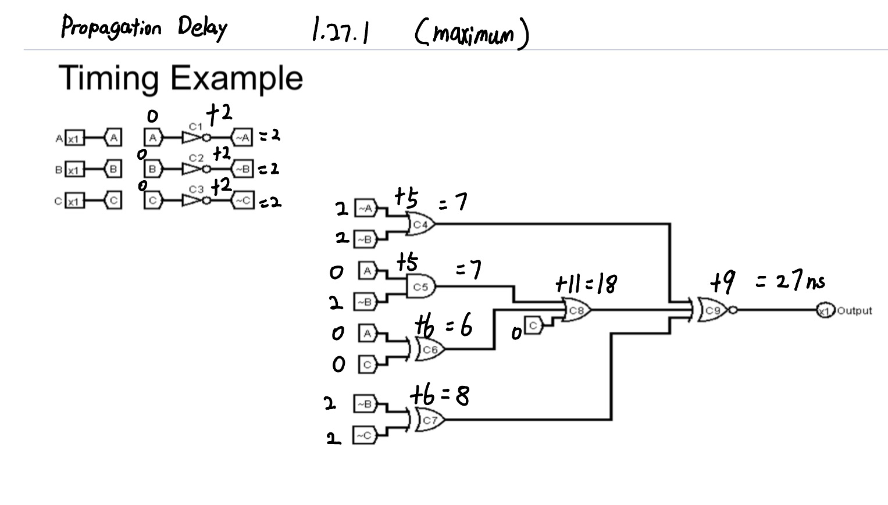

## [Timing, Muxes (Lecture 01-30-2023)](https://video.ucdavis.edu/media/ECS154ALecture01-30-2023/1_77yqyg4v)

##### Timing Example Contamination

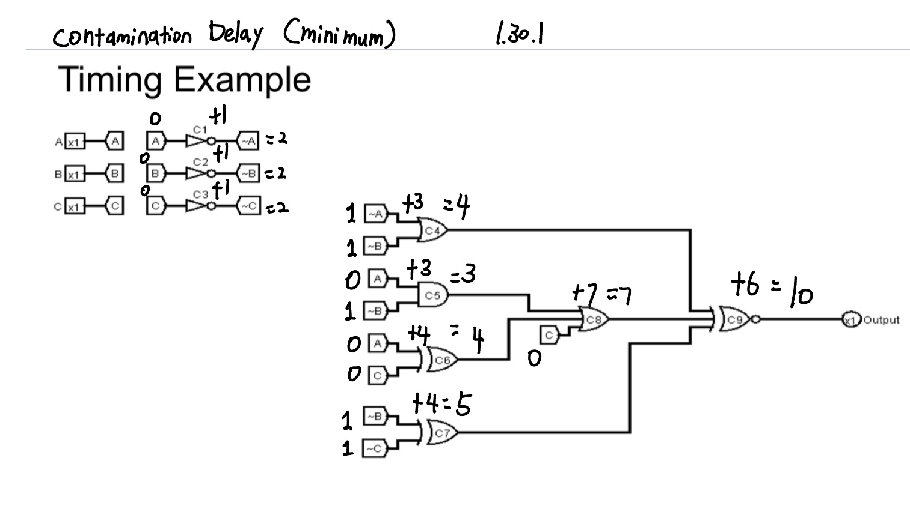

##### Timing Diagrams

- A timing diagram shows the output of a circuit over time
  - It is another way of representing a truth table but it can also show physical delays in the circuit
- Examples of A XOR B is both with and without delay are below
  - Notice with the delay the XOR output is shifted to the right 1ns

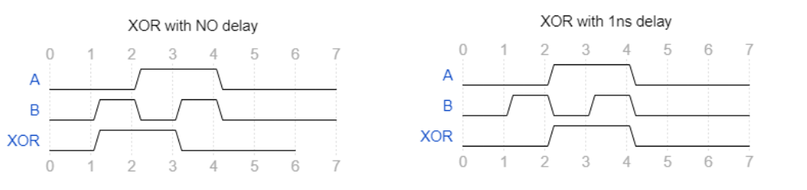

##### Glitches

- A glitch or hazard is when a change in a **single** input causes more than 1 output

- A glitch is not a problem in most circumstances, we just have to wait for the propagation delay

- A glitch happens when transitioning between two adjacent circles on a K-Map

- The glitch can be fixed by including the redundant term between the two circles

- Glitches can also occur if multiple inputs change simultaneously but they can’t be removed by adding more hardware

  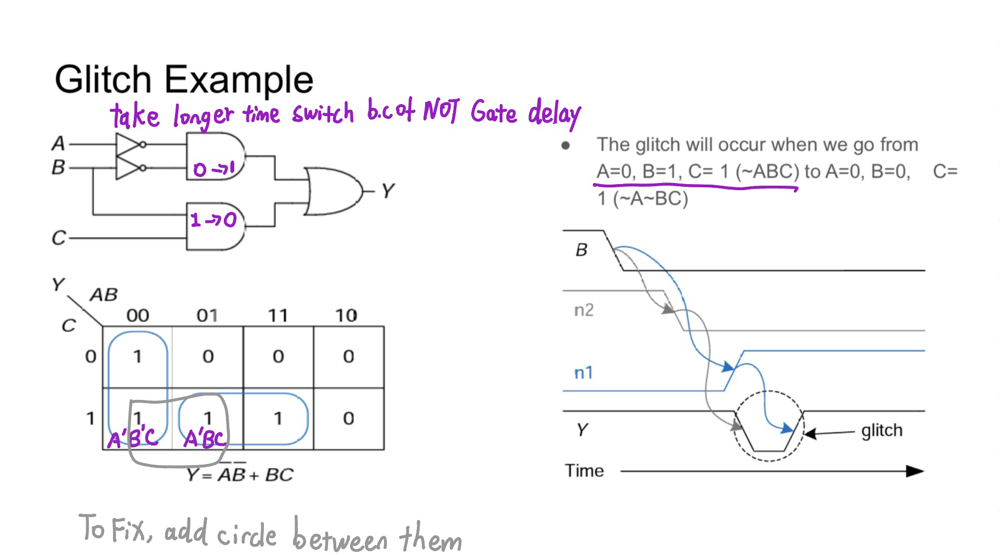

### Chapter 2.5 Combinational Building Blocks

##### Combinational Building Blocks

- There are a few common problems that need to be solved in combinational programs so we’ve come up with digital components to solve those problems
  - Selection - Multiplexer
  - Direct a signal - Demultiplexer
  - Decoding - Decoder
  - Arithmetic - Adder, Multiplier, Divider

##### Multiplexer

- A Multiplexer selects one of its data ports to forward to the output based on the selection signal

- It behaves like an if statement from programming

  | S    | Output |
  | ---- | ------ |
  | 0    | D0     |
  | 1    | D1     |

`If(s = 0) output = D0	If(s=1) output = D1`

##### Multiplexer Implementation

| S    | D1   | D0   | Out  |
| ---- | ---- | ---- | ---- |
| 0    | 0    | 0    | 0    |
| 0    | 0    | 1    | 1    |
| 0    | 1    | 0    | 0    |
| 0    | 1    | 1    | 1    |
| 1    | 0    | 0    | 0    |
| 1    | 0    | 1    | 0    |
| 1    | 1    | 0    | 1    |
| 1    | 1    | 1    | 1    |

| SD1/D0 | 00    | 01    | 11   | 10   |
| ------ | ----- | ----- | ---- | ---- |
| 0      | 0     | 0     | *1*  | 0    |
| 1      | **1** | **1** | *1*  | 0    |

- SOP: SD1 + ~SD0

##### Larger Multiplexers 

- In general a multiplexer has $2^N$ data inputs and therefore requires N select bits to choose which one will be the output
  - 2:1, 4:1, 8:1, etc multiplexers
- These larger multiplexers can be constructed from gates or from trees of other multiplexers
- Sometimes you will see muxes or other circuit elements where the wires are larger than 1 bit big
  - Generally written as a slash through the wire with a number (N) next to it
  - This is shorthand notation for N elements in parallel 

`Create larger mux with single switch mux`

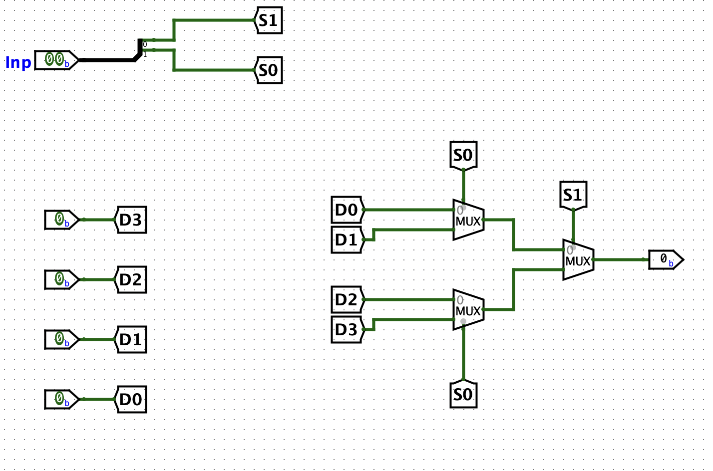

## [Muxes, Demuxes, Decoders, Adders (Discussion 01-30-2023)](https://video.ucdavis.edu/media/ECS154ADiscussion01-30-2023/1_wcks5hju)

`3 databits mux`

##### Multiplexer - Uses

- Select a value
- Implement a combinational function
  - If you have a mux with N select bits you can implement any function of N variables with just power and ground
  - If you have more gates you can potentially use a smaller mux
  - Here is an XOR gate made from a MUX

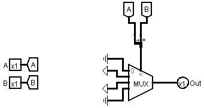

##### Demultiplexer

- A demultiplexer functions like a **railroad switching** statement in that it takes in one input and directs it to one of $2^N$ outputs based on the select bits
- Here is a truth table for a 1:2 demultiplexer

| S    | Out1 | Out0 |
| ---- | ---- | ---- |
| 0    | 0    | D    |
| 1    | D    | 0    |

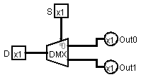

##### One Hot Decoder

- A one hot decoder has N inputs and 2N outputs
  - Exactly one of those outputs will be 1 for each combination of inputs
  - Each output is a minterm
- Below is a 2:4 decoder

| X1   | X0   | Out3 | Out2 | Out1 | Out0 |
| ---- | ---- | ---- | ---- | ---- | ---- |
| 0    | 0    | 0    | 0    | 0    | 1    |
| 0    | 1    | 0    | 0    | 1    | 0    |
| 1    | 0    | 0    | 1    | 0    | 0    |
| 1    | 1    | 1    | 0    | 0    | 0    |

- Normally these are drawn as a rectangle but logisim does it a little different

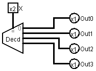

##### Uses for a decoder

- Identifying a bit pattern
- Implementing a function when combined with an OR gate
  - Each output is a minterm and if we OR the minterms of our function together we can produce it in a circuit

##### Half Adder

| A    | B    | Sum  | Carry Out |
| ---- | ---- | ---- | --------- |
| 0    | 0    | 0    | 0         |
| 0    | 1    | 1    | 0         |
| 1    | 0    | 1    | 0         |
| 1    | 1    | 0    | 1         |

- Sum = A ^ B
- CarryOut = A * B

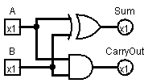

##### Full Adder

| Carry In | A    | B    | Sum  | Carry Out |
| -------- | ---- | ---- | ---- | --------- |
| 0        | 0    | 0    | 0    | 0         |
| 0        | 0    | 1    | 1    | 0         |
| 0        | 1    | 0    | 1    | 0         |
| 0        | 1    | 1    | 0    | 1         |
| 1        | 0    | 0    | 1    | 0         |
| 1        | 0    | 1    | 0    | 1         |
| 1        | 1    | 0    | 0    | 1         |
| 1        | 1    | 1    | 1    | 1         |

- Sum = A ^ B ^ Cin
- Cout = AB + ACin + BCin

`In logism, XOR Gate needs to be selected at When an odd number are on`

##### Ripple Carry Adder

`To connect full adder adding more numbers.`

- If we want to add N bit numbers together we can simply hook up N full adders together, feeding the Carry out of the prior stage into the the Carry in of the current stage
- The downside of this method is that the adder produced will be slow as we have to wait for the carry to propagate all the way through to the last stage

​	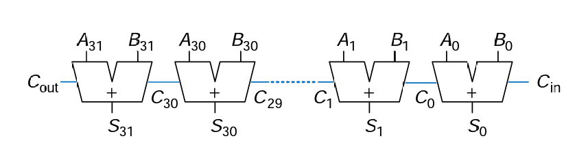

##### Prefix Adder

- To reduce the delay on the carry we calculate the carrys in parallel
- Let Gi = Ai * Bi `G stands for generate. If Ai and Bi both = 1, we will have a carry in`
- Let Pi = Ai ^ Bi `P stands for Propagate`
- Let C0 = G0 + P0 * Cin 
- Then Ci = Gi + Pi * Ci - 1
- Si = Ai ^ Bi ^ Ci - 1
- If we don’t distribute the terms we have ripple carry
- If we do distribute the terms we have a prefix Adder
- While this does speed things up, it comes at the cost of a lot more hardware

- $C_4 = G_4+P_4G_3+P_4P_3G_2+P_4P_3P_2G_1 + P_4P_3P_2P_1G_0 + P_4P_3P_2P_1P_0*C_{in}$

## [Adder Timing, Multipliers, Constant Shift (Lecture 02-01-2023)](https://video.ucdavis.edu/media/ECS154ALecture02-01-2023/1_9mq4zko9)

`Solve each bit independently when building circuits.`

$G3+P3(G2+P2(G1+P1(G0+P0Cin)))$

Timing: delay of 0->1->2->3->4->5->6->7->8

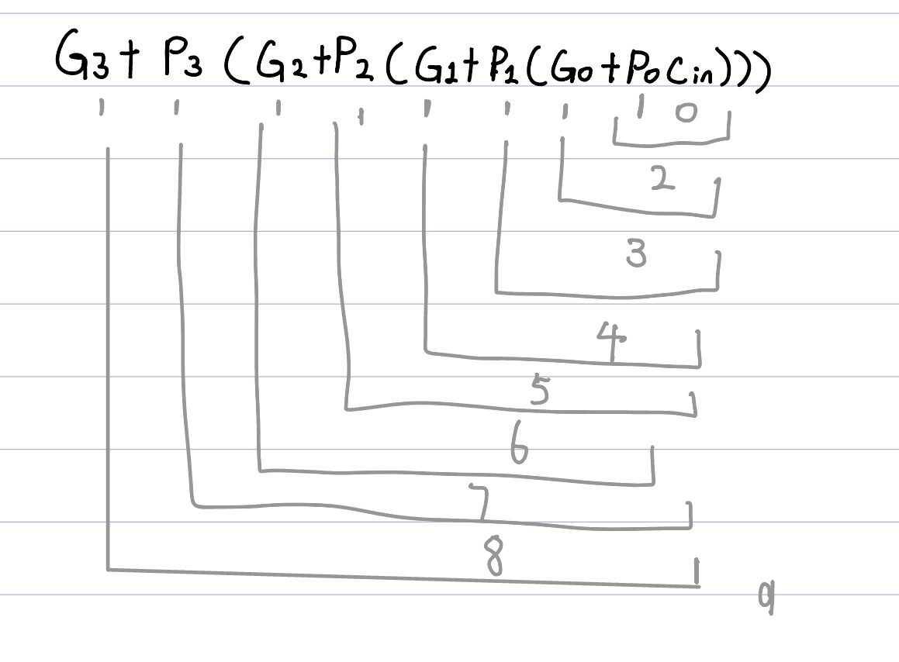

`Carry out feed into the carryin of the next stage.`

###### Subtraction

- A-B = A + -B
- How to turn B into -B?
  - By 2's complement, we flip all of the bits and add one
  - In circuits, we add a NOT gate on B and carry in 1.

###### Process of Multiplication

- 10110 x 01001 = 10110 x 1 (AND Gate)

- How does shifter work?

  

  

## [Constant Shift, Comparators, ALU, Start Sequential Logic(Lecture02-03-2023)](https://video.ucdavis.edu/media/ECS154ALecture02-03-2023/1_svgrmrsf)

`If theres a constant shift, we grab the last bits to become the top and add 0.`

`XOR need to be set to odd number are on`

##### Division

##### Comparators

- Equality is easy, just make sure that all the bits in the same positions have the same value
  - XNOR can be used to check if two bits have the same value
  
- Inequality is generally implemented with subtraction
  - If A - B is positive A > B
  
  - If A - B is negative A < B
  
  - Just have to check the most significant bit of the subtraction to find out
  
    - Positive numbers will start with 0
  
    - Negative numbers will start with 1
  
      `Four bit comparator example`

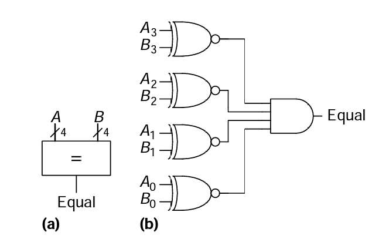

##### ALU

- 3 inputs: A/B (data value you worked on), F (select the operation)

- N means more than one bit

Example of ALU

- 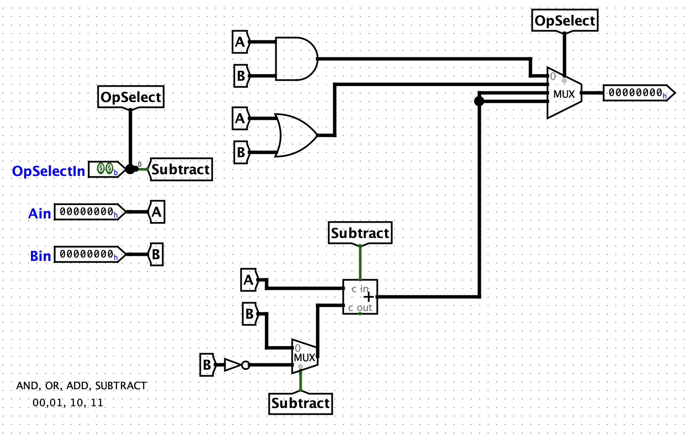

`we have to waste hardware to have all of the operation`

`Bit Extender: fulfill all of bits to the inputs`

`Control Buffer: Enable: the value just go through. Disable: U come through`
