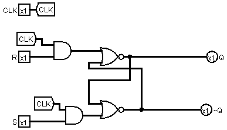
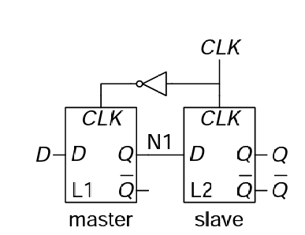
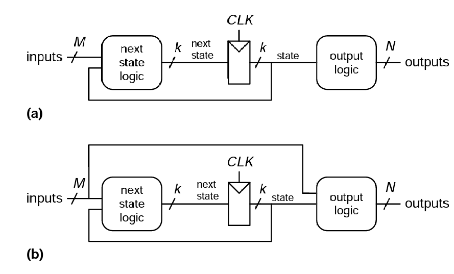
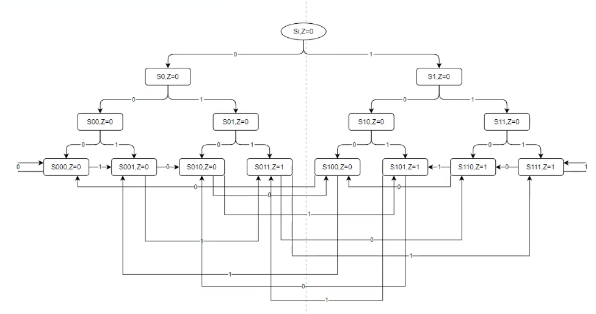

### Chapter 3 Sequential Logic

##### Sequential Logic

- With sequential logic the output is dependent not only on the current input but also on its current state
  - Its current state is based upon the previous inputs it received
  - This is in contrast to combinational logic where the output is dependent solely on the current input
- To be able to store state we need to be able to remember values but how to do that in circuitry? 

##### Memory - A first Attempt

- Case 1: Q = 0
  - I2 receives 0 and outputs 1
  - I1 receives 1 and outputs 0
- Case 2: Q = 1
  - I2 receives 1 and outputs 0
  - I1 receives 0 and outputs 1
- This circuit is bistable because it has two different stable states it can be in
- While this could be used to store a value the problem is we can’t change it

##### SR Latch (S for set, R for Reset)

- Case 1: R = 1, S = 0
  - 1 NOR Anything is 0 so N1 outputs 0
  - N2 receives two 0’s which is 1
  - Q = 0, ~Q = 1
- Case 2: R = 0, S = 1
  - 1 NOR Anything is 0 so N2 outputs 0
  - N2 receives two 0’s so outputs 1
  - Q = 1, ~Q = 0
- Case 3: S = 1, R = 1
  - 1 NOR Anything is a 0 so both gates output 1
  - Q = 0, ~Q = 0
- Danger both Q and ~Q have the same value so you should never set both S and R to 1

## [Latches and Flip-Flops (Lecture 02-06-2023)](https://video.ucdavis.edu/media/ECS154ALecture02-06-2023/1_4k63al1l)

- Case 4: R = 0, S = 0

  - 0 NOR Something depends on what the something is so we have to look at values of Q to get the behavior of the Circuit

- Case 4A: Q = 0

  - 0 and 0 both go into N2 so N2 outputs a 1 and ~Q is 1
  - 1 and 0 go into N1 so N1 outputs 0
  - Q = 0, ~Q = 1

- Case 4B: Q = 1

  - 1 and 0 both go into N2 and so N2 outputs 0

  - Two 0’s go into N1 so N1 outputs 1

  - Q = 1, ~Q = 0

  - 

    `R = 0, S = 0, the output store the behavior before, R = 1 means reset the Q to be 0. S = 1 means set the value to be 1`

##### SR - Latch (With Clock)

- The implementation on the previous slide allows us to choose what values to store but doesn’t provide any control for when we store the values
- To do this we add the Clock control signal

| CLK  | S    | R    | Q    |
| ---- | ---- | ---- | ---- |
| 0    | d    | d    | Q    |
| 1    | 0    | 0    | Q    |
| 1    | 0    | 1    | 0    |
| 1    | 1    | 0    | 1    |
| 1    | 1    | 1    | X    |

`when the clock is 0, we "stay same" for the Q`

| D    | Q‘   |
| ---- | ---- |
| 0    | 0    |
| 1    | 1    |

| D    | Q    | Q' (new value of Q) |
| ---- | ---- | ------------------- |
| 0    | 0    | 0                   |
| 0    | 1    | 0                   |
| 1    | 0    | 1                   |
| 1    | 1    | 1                   |

Truth Table for SR Latch

| S    | R    | Q'   |
| ---- | ---- | ---- |
| 0    | 0    | Q    |
| 0    | 1    | 0    |
| 1    | 0    | 1    |
| 1    | 1    | X    |

Final Output

| D    | Q    | S    | R    |
| ---- | ---- | ---- | ---- |
| 0    | 0    | 0    | d    |
| 0    | 1    | 0    | 1    |
| 1    | 0    | 1    | 0    |
| 1    | 1    | d    | 0    |

K-Map for S

| D/Q  | 0    | 1    |
| ---- | ---- | ---- |
| 0    | 0    | 1    |
| 1    | 0    | d    |

`S = D`

K-map for R

| D/Q  | 0    | 1    |
| ---- | ---- | ---- |
| 0    | d    | 0    |
| 1    | 1    | 0    |

`R = !D`

##### D - Latch

- In order to resolve the inconsistency for when both S and R are 1 we can instead use a D Latch 
- A D Latch just stores the value that it is given
- A D Latch can be built from an SR Latch and some other logic as follows 
- S = D 
- R = ~D

| D    | Q    |
| ---- | ---- |
| 0    | 0    |
| 1    | 1    |

##### T Latch

- The T in T latch stands for toggle

- Goal

| T    | Q    |
| ---- | ---- |
| 0    | Q    |
| 1    | ~Q   |

- | D    | Q‘   |
  | ---- | ---- |
  | 0    | 0    |
  | 1    | 1    |

- Figure out what to put in D

- | Q    | T    | D    |
  | ---- | ---- | ---- |
  | 0    | 0    | 0    |
  | 0    | 1    | 1    |
  | 1    | 0    | 1    |
  | 1    | 1    | 0    |

  The output is a XOR Gate

  

##### JK Latch

- The JK Latch behaves like the SR latch with J being S and K being R but it has a defined behavior for when both J and S are 1, it toggles the value of Q

| J    | K    | Q    |
| ---- | ---- | ---- |
| 0    | 0    | Q    |
| 0    | 1    | 0    |
| 1    | 0    | 1    |
| 1    | 1    | ~Q   |

##### Master Slave D Flip Flop

- Flip Flops are similar to latches but instead of allowing values to change when the clock is 1 they can only change values when 
  - The clock transitions from 0 to 1 (rising edge triggered) 
  - Or the clock transitions from 1 to 0 (falling edge) 
- We can build a D Flip Flop from two D latches as is shown on the right

 

## [Finish Flip-Flops, Start Sequential Circuit Design(Discussion 02-06-2023)](https://video.ucdavis.edu/media/ECS154ADiscussion02-06-2023/1_2ioh2u92)

###### T - Flip Flop Truth Table

| D    | Q‘   |
| ---- | ---- |
| 0    | 0    |
| 1    | 1    |

| T    | Q‘   |
| ---- | ---- |
| 0    | Q    |
| 1    | ~Q   |

| Q    | T    | D                                                            |
| ---- | ---- | ------------------------------------------------------------ |
| 0    | 0    | (T is 0, we want Q' = Q based on table 2, so Q' is 0, so based on table 1.   D = 0) 0 |
| 0    | 1    | (T is 1, we want our value to be = ~Q, so Q' is 1, so D = 1) 1 |
| 1    | 0    | (T is 0, we want our value to be = Q, so Q' = 1, so D = 1) 1 |
| 1    | 1    | (T is 1, we want out value to be = ~Q, so Q' = 0, so D = 0) 0 |

###### SR Latch

| D    | Q‘   |
| ---- | ---- |
| 0    | 0    |
| 1    | 1    |

| S    | R    | Q'   |
| ---- | ---- | ---- |
| 0    | 0    | Q    |
| 0    | 1    | 0    |
| 1    | 0    | 1    |
| 1    | 1    | X    |

Output (Fill in S and R)

| D    | Q    | S                                                            | R       |
| ---- | ---- | ------------------------------------------------------------ | ------- |
| 0    | 0    | (D is 0, I want Q' = 0 based on Table 1, based on Table 2 row 1 and 2 Q' = 0, so S = 0 and R = 0/1) 0 | (0/1) d |
| 0    | 1    | (D is 0, I want Q' = 0, based on Table 2 row 2 Q' = 0, so S = 0 R = 1)   0 | 1       |
| 1    | 0    | (D is 1, so I want Q' = 1, based on Table 2 row 3 Q' = 1) 1  | 0       |
| 1    | 1    | (D is 1, so I want Q' = 1, based on Table 2 row 1 and 3 Q' = 1, so S = 1 or 0) d | 0       |

##### Synchronous Circuits

- Synchronous circuits are built using only 
  - Flip Flops 
  - Combinational Logic 
- All Flip Flops use the same clock 
  - This is like the beat of a drum on a rowboat in that everyone moves in time with the clock 
- While not as flexible as asynchronous circuits due to component constraints and the need to share a clock, they are easier to design and less prone to error 
- These benefits are so great that almost all circuits are synchronous circuits

 

##### Finite State Machine Design Process

1. Choose whether you want to implement a Moore or Mealy Model Machine 
2. Draw the state diagram 
3. Simplify the state diagram 
4. Choose encodings for the states 
5. Choose Flip Flop Type 
6. Derive the next state equations 
7. Derive the output equations 
8. Build the circuit

##### Moore and Mealy Model Machines

- Moore the output is dependent only on the current state 
- Mealy the output is dependent on the current state and current input 
- Both use the current state and current inputs to find the next state to go to
- A is a Moore
- B is a Mealy

##### Draw the State Diagram

- This is the part where you have to think
- The state diagram is problem dependent
- Moore Model Machine the outputs are inside the states
- Mealy Model Machine the outputs are on the edges

##### Simplify the state diagram

- Two FSMs are equivalent if they always have the same output for all inputs 
- Group together all states that will output the same value when given the same input into a super state 
  - Intuition: If the states output the same values on the same inputs they might be equivalent 
- Label each super state 
- For each super state 
  - For each state in the super state group them together if they transition to the same super states on the same inputs 
  - Close the groups created to prevent mistakes
- Repeat the last two steps until there is no change in the groupings

###### Example: output1 if there were at least 2 1's in the last group of 3 bits seen

`The above diagram max the information, but it could be simpler`

## [State Simplification (Lecture 02-08-2023)](https://video.ucdavis.edu/media/ECS154ALecture02-08-2023/1_6sz7jzs3)

###### Review

- Difference between Moore and Mealy Model Machiens
  - Moore the output is dependent only on the current state
  - Mealy the output is dependent on the current state and current input
- Draw the State Diagram
  - We drew the previous diagram that remember all the information possible.

##### Simplify the state diagram

| A    | 0's  | si   | s0   | s1   | s00  | S01  | s10  | s11  | s000 | s001 | s010 | s100 |
| ---- | ---- | ---- | ---- | ---- | ---- | ---- | ---- | ---- | ---- | ---- | ---- | ---- |
| B    | 1's  | s011 | s101 | s110 | s111 |      |      |      |      |      |      |      |

`Group states together by the output`

A group

| 0/1  |      |      |      |      |      |      |
| ---- | ---- | ---- | ---- | ---- | ---- | ---- |
| A/A  | Si   | S0   | S1   | S00  | S000 | S100 |
| A/B  | S10  | S01  | S001 | S010 |      |      |
| B/B  | S11  |      |      |      |      |      |

B group

| 0/1  |      |      |
| ---- | ---- | ---- |
| B/B  | S011 | S111 |
| A/B  | S101 | S110 |
