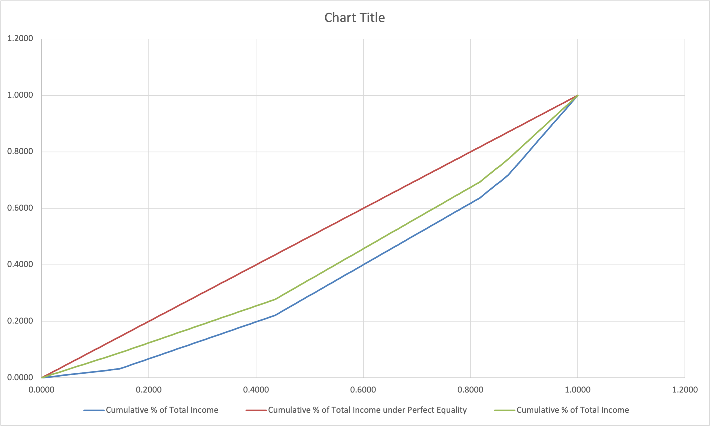

# 4/27 Lecture

### Recap

#### South Africa Economy

- Mandela elected president in 1994
  - End of **apartheid**
  - 2 Major economics policies
    - Restored <u>Economic Freedoms</u> for Black South Africans
    - Restored <u>Market Freedoms</u> in the overall economy.
  - Government limited by massive debt inherited from previous government

##### Transition Matrix

- Two poverty line (Poor, Indigent)
- Three Poverty Measure (Poverty headcount, average income shortfall of poor), FGT-2
- HCI increases under both poverty line
- Average income shortfall: Mixed story
  - Increases for HSL poverty line, but decrease for Indigent (more severe) poverty line.
    - Extreme poverty has beenn decreased
- FGT-2: Mixed story
  - Increases for HSL poverty line (from 0.03 to 0.063)
  - Decreases for Indigent poverty line (from 0.005 to 0.0004)
  
  

##### HSL (Focus on individual household)

- HSL is the poverty line (Household Subsistence Line)
- ⬇️ Household's position in 1993
- ➡️ Household's position in 1998
- Numbers in brackets are % of sample in that class in 1993
- Cells tell us fraction of class from 1993 that ended up in each of the different classes in 1998.

###### Example 1

- In 1993, 3.3% of the sample was in the lowest class.
- In 1998, 12.8% of these 3.3% had move up to the third class. (1-1.25 HSL)
- which represents 0.033 x 0.128 = 0.42% of the total sample

###### Example 2

- In 1993, 17.6% of the sample was in highest class (>2.5 HSL)
- In 1998 7.8% of these 17.6% had fall into second class (0.5-1 HSL)
- which represents 0.078 x 0.176 = 1.37% of the total sample.

###### Clicker Question

Which box represents households in chornic poverty?

- Box A
  - **Chronic Poverty** means below the poverty line in both periods.

- Box C and B is **Transitory Poor**

###### Mobility in Both Directions

- Upward
  - 12.8 + 7.7 + 5.1 = 25.6% of the poorest in 1993 left poverty
  - 14.2 + 5.1 + 14.9 + 1.1 = 35.3% of the less poor left poverty
- Downward
  - 12.6 + 47.1 =53.7% of just above poverty fell into poverty
  - 10.7 + 35.9 = 46.6% of class 4 fall into poverty.

### Inequality

##### What do we mean by inequality?

- Two most common notion of inequality:
  - **Categorical** Inequality
  - **Conventional** Inequality (We are going to focus on this)

##### **Conventional** Inequality

`What we will learn in class`

- Focus on how the outcome () is distributed in a single group
  - Focus on the shape of distribution
  - More "spread out" the distribution, the greater is inequality

- Example Questions:
  - Compare inequality across groups at a given point in time
    - is income distributed more equally in China vs India?
  - Compare inequality of the same group at two points in time
    - Is the distribution of wealth in the US more or less equal today than it was 20 years ago?
  - Compare inequality with versus without a specific policy
    - Is the distribution of income more or less equal if we enact a $20 minimum wage?

##### Categorical Inequality

`What we talk about on the news`

- Compares average (mean or median) outcomes (wealth, education, income, etc.) across groups
- Focusses on size of the "gap" between groups
  - Larger the gap, greater the inequality

- Example:
  - Rural vs Urban Income Disparities in China
  - Wealth Disparities by Race in the U.S.

##### How do we compare inequality?

How do we know if one distribution is more unequal than another?

- Shape

  - 

  - C is more "spread out", it has **greatest** inequality.
  - C > B > A

###### Clicker Question

In which country is inequality greater?

A. Mexico	B. United States

- It is not easy to conclude by just looking at the shape sometimes.
  - Mexico has 60 times wealthiest to poorest income difference.

#### Goal: Systematic Ranking of Inequality

- How can we compare and rank the degree of inequality across two distributions?
  - Two different methods
    - Method 1: **Lorenz Curve**
    - Method 2: **Gini Coefficient**

#### Lorenz Curve

- Common way to compare inequality of two (or more) distribution with a picture
  - X-axis: Cumulative % of population.
  - Y-axis: Cumulative % of total income
  - A point tells us: "What % of total income is held by the poorest X% of the population?"

- **A**: 0% of population earn 0% of total income
- **B**: 20% of population earn 9.4% of total income
- **C**: 60% of population earn 40% of total income
- **D**: 100% of population earn 100% of total income
  - Point (0, 0) and (100, 100) are always on the Lorenz Curve

###### Clicker Quiz

Which country is inequality greatest?

- Brasil

- The **farther** away from 45-degree line, the **greater** is inequality

What % of of total Y do the richest 20% control in each country?

- Sweden: 1-0.6 = 40%
- Costa Rica: 1-0.4 = 60%
- Brasil : 1-0.3 = 70%

##### Problem with Lorenz Curves

- If Lorenz curves cross, we cannot rank the degree of inequality across two distributions just by looking at the graph...

##### Excel with Lorenz Curves

https://canvas.ucdavis.edu/courses/784703/files/folder/Lecture%20Slides?preview=20419379

# 5/2 Lecture

### Announcement

- Today wrap up inequality (Excel Review, Gini Coefficient and Lorenz Curve)

- Thursday Reading: https://canvas.ucdavis.edu/courses/784703/files/folder/Lecture%20Slides?preview=20419379 
  - Midterm Review on Thursday
- Discussion section remote
- Reflections - open early
- Problem Set 2 - Due Thursday 11:59pm, Every student submits their PDF, One PDF submission
- Office Hour before Midterm:
  - Monday: 10 - Noon
- Midterm:
  - Next Tuesday, Practice Exam on Canvas, No EXCEL, Closed Books, and 1 index card (5 inch x 7 inch)
- Plan for today:
  - Lorenz Curve and Gini in Excel
  - More Intuitions on Gini

### Excel for Lorenz Curve & Gini Coefficient

- To graph Lorenz Curve, we need first sort from income level smallest to largest, then
  - Cumulative % of population
  - Cumulative % of Total Income
  - Cumulative % of Total Income under Perfect Equality (same as Cumulative % of population)

- Gini Coefficient = 2*Cov(y, F(y)) / mean(y)
  - y is income level for each individual
    - Mean(y) is the average income in this population.
  - F(y) is the cumulative % of population 

[Lecture_08_(April_27)_Excel_for_Lorenz_and_Gini.xlsx](../../../2023 Spring/ARE 115A/Lecture_08_(April_27)_Excel_for_Lorenz_and_Gini.xlsx) 

### Excel for Policy

- Policy 1: 25% income tax, no transfer
  - If we increase or decrease same percentage of everyone's income, inequality (distribution) should be constant (unchange).
  - Lorenz and Gini Coefficient would be same

- Policy 2: 25% income tax on RICHEST; Give equal amount to poorest
  - 
  - green is after policy, blue is original
  - more equally distributed

### Why do we care about inequality?

- Normative argument: just not fair
- Positive argument: high degree of inequality create **high degree of economic inefficiency**
  - Social unrest: strike / violence
    - No confidence in local police / Don't feel safe walking home alone / Have had money or property stolen / Have been assaulted (positive correlation)
  - credit system (*after midterm*)

### Inequality Indices

- A rule/ forumla take input of distribution output a single number.
  - Output is larger, higher inequality
- Four criteria for a good inequality indices
  - Symmetry
    - Should not depend on the identity of individuals (if switch persons, index would not change)
  - Independence of scale (relative income)
    - Percent change does not affect the index
  - Homogeneity
    - Should not depend on the size of the population
  - Transfer Principle
    - If we make a regressive transfer, then our index should get larger.  
      - Take moeny away from poor to rich person, inequality would be higher.
- Common inequality indices that do not satisfy the 4 criteria
  - Range/Kuznets Ratio: do not satisfy the Transfer Principle
  - Gini coefficient satisfy the four criteria

### Gini Coefficient

- $Gini = \frac{2*COV(F(y),y)}{\mu}$

- Intuition Behind the Gini (Midterm!!!)

  - The average of all possible pair-wise comparisons of income of people in the population (or sample) normalized by the mean of income.
  - `The Gini Coefficient measure inequality, compare my income to everybody's income. How big are all of those pair-wise comparisons. `

  - If everyone has same income, Gini ends up being 0.

- Gini also = sum of all paiwise comparisons / (n^2 x mean x 2)

##### Example

- Income: Shuhan 50, Saloni 100, Adelaida: 200

|          | Shuhan       | Saloni        | Adelaia       |
| -------- | ------------ | ------------- | ------------- |
| Shuhan   | 50-50 = 0    | 50-100 = 50   | 50-200 = 150  |
| Saloni   | 100-50 = 50  | 100-100 = 0   | 100-200 = 100 |
| Adelaida | 200-50 = 150 | 200-100 = 100 | 200 - 200 = 0 |

- Sum all pairwise comparisons = 0 + 50 + 150 + 50 + 0 +100 + 150+ 100+ 0= 600 (sum all of them together)
- Mean income = (50+100+200) / 3 =116.7
- $Gini = \frac{sum}{n^2*\mu*2} = \frac{600}{9*116.7*2} = 0.286$
- Gini coefficient in this example is 0.286

### Why covariance telling us inequality

- Equation of Covariance between two variables:
  - $cov(x,y) = \sum^{N}_{i=1} \frac{(xi-\bar x)(yi-\bar y)}{N}$

# 5/4 Lecture

### Announcement

- Today

  - Behavioral & Experimental Economics, Psychology and Poverty

  - Midterm Review, questions

- Midterm
  - Similar to practice midterm
  - 1 index card 5'' x 7''
- In-person discussion sections

### Poverty & Decision Making

- If I want to have more money next year
  - Save:
    - Save in bank and get interests next year
  - Invest:
    - Put in emerging market fund
    - Risky 20% or -20%

- Two fundamental characteristics
  - Discount Rate
    - Patient
  - Risk Aversion

#### Discount Rate

- Tells us how much more I value a given amount of money today vs. some point in the future
- What rate do I "discount" the future?
  - Don't consider inflation.
  - we use symbol `d`. Larger the `d`, more impatient I am.

##### Example

- If you indifferent between 100 today and 105 one year from today
  - Your d = 0.05
  - If prefer receive 100 today, d > 0.05
  - If prefer receive 105 one year later, d < 0.05

#### Risk Aversion

- The degree to which I am sensitive to (or dislike) risk.
- Three types: Risk Averse, Risk Neutral, Risk Loving

- Example coin toss:
  - A. Receive $2
    - Always get 2
    - Risk averse
  - B. Flip coin: receive 10 if head, lose 5 if tails
    - On average, expected value, you get 0.5 x 10+ 0.5x(-5) = 5-2.5 = 2.5
    - Less risk averse

### Preference Parameters

-  Parameters like discount rate and degree of risk aversion
- Vary across individuals. And will not change.

Who do we expect to save more?

- Lower `d`, because they are more patient.

Who is going to choose risk investment?

- Person with low risk aversion.

### Experimental Economics

- How do we "measure" the preference parameters?
- Create controlled setting and ask subjects to make choices that reveal their preferences. (Will pay real money for their decision!)
- Treatment group and Control group to see if there is a causal impact on people's preferences.
- Sign up to participate the Econ Experiment...

...

### 这里讲了读的paper 跳过

### Midterm Review

- GDP Measurement
- Measuring GDP Y =I + C+ G +NX
- Problems/Issues in GDP Measurement
- Non-marketed Good & Services
- Comparing GDP
  - How do you calculate PPP exchange rate? What's the difference than official exchange rate.
- Overtime
  - CPI Consumer Price Index, Inflation rate
  - Calculate inflation from this year to next
- Poverty measure (Write on index)
  - Headcount Inde (HCI)
  - Total Poverty Gap (TPG)
  - Poverty Gap Index (PGI)
  - FGT a = 2 

- Transition Matrix
  - What does poverty transition matrix tell us
  - Mobility
- Inequlity
  - Lorenz Curve
    - Crossing Lorenz Curve
      - If Lorenz Curve do not cross, we can compare countries to countries
      - Else if they do cross, we cannot use Lorenz Curve to rank inequality
  - Gini Coefficient
    - You need to know the pairwise comparison formula for the midterm
