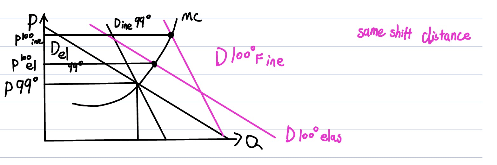
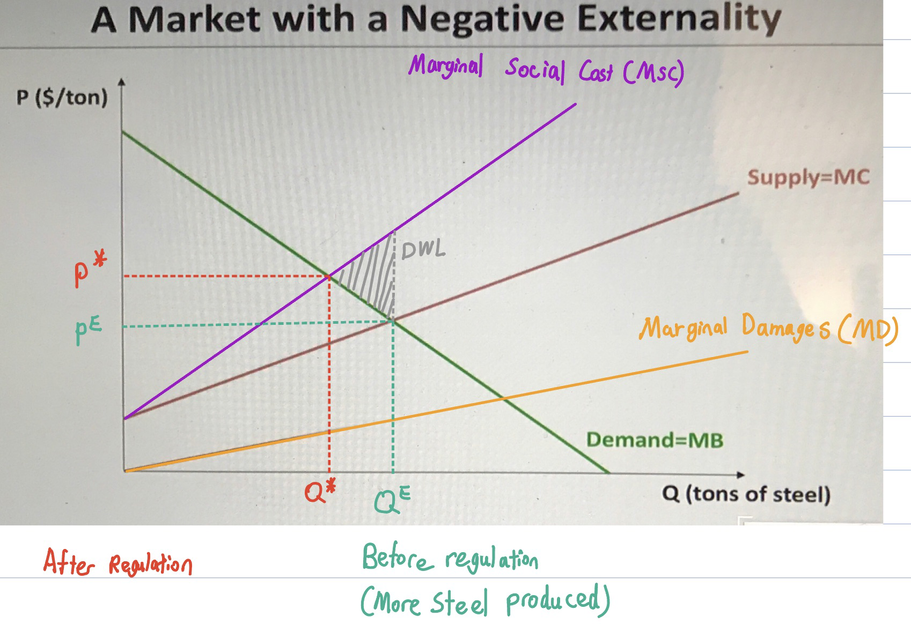

## 11/1 Lecture

##### Rate of Return Regulation

- Rate of return regulation	$\sum_{i=1}^{n}p_iq_i = Expenses+sB$	$=>$	 $TR = TC$

  `s = allowed to earn a rate of return for natural monopoly`

  - pi: price of ith service

  - n: number of services

  - s: allowed rate of return

  - B : rate base; measure of value of regulated firm’s investment

    `regulators job to generate the rate of return for natural monopoly`

- Things to consider

  - What is allowable rate of return?

  - What should comprise rate base?

    `Firm always wants to rate increase.`

    `Experts testify the costs, committe decide the rate of return`

  - What should price be?

  - Implications of regulatory lag

## 11/3 Lecture

##### Rate of Return Regulation

- Regulation in practice
  - Firm must have rate changes approved by regulator
  - Firm often initiate a hearing if it wants a rate increase
  - Rate hearings are a quasi-judicial process to decide appropriate rate
  - After hearing rate of return selected and prices adjusted

##### Rate Base

- Measuring the value of the regulated firm’s investment
  - Base on which return can be earned
  - Excessive investments may be excluded from rate base  - CA nuclear plant
- Original cost method 
  - Amount company paid for plant and equipment less depreciation
  - Problematic if inflation because current costs not reflect LRMC
  - In this case, price too low and over-consume
- Replacement cost
  - Cost to replace capacity with newest technology
- Market value method
  - add up value of company’s outstanding stocks and bonds

##### Regulatory Lag

- Rates remain unchanged until next rate case
- Incentive for firm to cost minimize
  - Earn higher rates of return than allowed if can reduce cost
  - Also earn lower rate of return if costs rise
- If continuous price adjustment, no incentive for cost efficiency
- Inefficiency in adjusting prices allows for productive efficiency

##### Averch-Johnson Effect

- Incentive to overinvest in capital
  - Occurs because earn rate of return on capital
- Assumption: rate of return on capital higher than true cost of capital 
- Model:  Firm chooses capital and labor to maximize profits subject to rate of return constraint
- Intuition: Since perceived cost of capital is less than true cost, there is discount to investment in capital

##### Problems with RoRR

- Cost-plus not incentive regulation 
  - Earn revenue that is some fixed amount above cost
- Weak incentive to reduce costs or innovate
- Incentive to over-invest in capital

##### Incentive Regulation: Price Cap

- $\dot{P} = I-X$
  - Price charged allowed to rise at rate of inflation less an offset
  - for a specified period of time (price cap period)
    - $\dot{P}$: rate of price increase 
    - $I$: rate of price inflation in economy
    - $X$: productivity offset
      - extent to which price increases more slowly than other prices
- Idea: prices linked to other price increases in economy

##### Price Cap Regulation: Z Factors

- What about major anticipated events?
  - What is a tornado damages a facility?
- $\dot{P} = I-X+Z$
  - Prices allowed to rise to offset financial impact of unforeseen shock
- Ensures firm held responsible for performance on dimensions it  can control but not for ones it cannot
- Example: retail electricity prices varying 

##### Earnings Sharings

- Explicit limits on realized earnings pre-determined
  - Prevents extremely high and low earnings a la PCR 
- Example:
  - $r$							 if $r \le \underline{r}$
  - $\underline{r}+\theta(r-\underline{r})$ 		if $\underline{r}\le r \le \bar r$
  - $\underline{r}+\theta(\bar{r}-\underline{r})$		if $\bar{r} \le r$ 
  - $r$: net rate or return; 		$\theta$ : share of excess profits
- Example: Given $\underline{r} = 0.06$ let $\bar{r} = 0.1$
  - if r = 0.05, firm earn 0.05
  - if r = 0.08, firm earn $0.06+\theta(0.08-0.06)$
  - if r = 0.11, firm earn $0.06+\theta(0.1-0.06)$
- Disadvantage: dull incentives for major cost reductions

##### Performance Regulation in Electricity

- In electricity, performance based regulation
- Establish important dimensions of performance
- Tag rewards and penalties to these
  - E.g.: Rewarded for reducing interruptions below levels
- Can mold and tailor to more closely mirror PCR

##### Yardstick Regulation

- Use other regulated firms price and performance as benchmark 
- Occurs when oversee multiple firms in distinct region
- Example: water
- Challenge: difficult to find credible “controls”

##### Structure of Industry

- Generation (power plants)
- Transmission lines (long distance, high voltage)
- Distribution lines (local, low voltage)
- Retail and billing (primarily financial business)

- Historically, vertically integrated so 1 firm did all three

  - Investor owned utilities or some public
  - Regulated according to rate-of-return regulation by state 

  

##### Why Deregulate? 

- Economic Rationale for Generation
  - Less scale economies
  - Rate of return regulation inefficient
    - Low incentives to develop more efficient plants
    - Better investment decisions if shareholders liable
  - Retail and billing: primarily a financial operation 
  - Transmission and local distribution remain regulated

## 11/10 Lecture

##### What is so special about electricity?

- Not storable
  - Enough capacity to meet peak demand
  - At every moment in time coordinate supply and demand
- Price volatility
  - Substantial differences peak and off-peak demand
  - Supply curve inelastic in range of peak demand
  - Short-run electricity demand very inelastic
  - Mismatch retail prices and wholesale costs
- These features may allow for market power

##### Price Volatility

1. Fluctuations in demand

   

   `Because we can't store electricity, have to have enough supply to meet demand`

   `You have to use more costly generation source`

   `Lead to price volatility.`

   

2. Supply inelastic in range of peak demand

   

   `Price are more volatile, MC Curve inelastic over the range of peak demand.`

3. Short-run electricity demand very inelastic

   

   `in the short run, demand will be more inelastic.`

4. Retail Prices Fixed

   

   `Customer not facing that change of demand.`

- 
  - $n_d=\frac{n+(1-S_d)\epsilon_f}{S_d}$
  - If $n$ is very inelastic, $\epsilon_f$ very inelastic, then even if $S_d$ is low, dominant firm face inelastic demand curve.
  - If the fringe is very inelastic and demand is really inelastic, then even with a small amount of market, they can exercise market power.

##### Basics of California Electricity Deregulation

- 3 Main Utilities
  - Pacific Gas and Electric, San Diego Gas and Electric, Southern California Edison
  - Sold about half of powerplant capacity to 5 private firms
  - Powerplant firms bid daily into auctions to supply power
- Retail prices were fixed 
  - Did not move at all with wholesale auction price

##### CA Electricity Crisis

- Summer 2000
  - Average wholesale price of electricity increased from 
    $30/MW to $150/MW 
  - Even reached $750 in some instances. 
  - But retail prices fixed 
- Utilities became financially insolvent 
  - Required to buy high and sell low
- California ultimately took over market functions
- The aftermath (see Borenstein 2002)

 

##### Headline “Facts” about 2000

- Price of inputs to generate electricity increased
  - Natural gas prices
    - 
  - Emission permits for NOx (“smog precursors”)
    - 
  - Decrease in hydroelectric power
- Demand was strong (unexpectedly hot weather)
- If the market was perfectly competitive

##### Headline “Facts” about 2000

- Wholesale prices skyrocketed
  - Average price 1998-99: about $30/MWh
  - Average price 2000: over $100/MWh
    - 1 MW supplies about 1000 houses
- High wholesale prices not passed onto consumers
  - Utilities “buying high and selling low”
  - Utilities lost creditworthiness
  - State government stepped in to buy power

### Lecture 15

##### What is public enterprise?

- Public enterprise owned and operated by gov’t
- Objective: maximization of social welfare
  - Objective of private firms is profit maximization
- Accountable to voters
  - Accountable to shareholders
- Examples
  - U.S. postal service, water, roads, airports, subway (BART)
  - Recent discussion: wildfires, PG&E, and public ownership
  - Focus on natural monopolies but other reasons for public enterprise
  - Ideological, punishment, situational, revenue raising

##### Theoretical Appeal

- Firm sets price to maximize consumer welfare
  - 

##### Challenges: Cost Considerations

- Limited expertise
  - Operation of services requires considerable expertise
  - Gov’t officials may not have this expertise so hire experts
  - Compensation constraints: private sector pays more
  - Expertise constraints: may not have expertise to identify best managers for job
- Limited incentive for productive efficiency
  - Private firms gain profits when reduce costs
  - Gov’t enterprise not focused on profit maximization, so incentive dampened or maybe absent

- Absence of discipline from capital markets
  - Private companies face threat of takeover 
  - No threat of take-over for gov’t enterprise
- Even if price to to maximize consumer welfare, because of higher prices consumers may not be better served

##### Why Public Enterprise?

- Provide services that do not confer a profit
  - Electricity and water service to rural communities
- Delivery of service quality dimensions that difficult to measure
  - E.g. quality of customer service
- Source of revenues and facilitate oversight
  - Sale of lottery tickets and hard liquor in some states

##### Which approach preferred?

- Municipal（市政） utilities
  - Small, focused on electricity distribution, 20% sales, publicly owned
- Pricing behavior:
  - Mixed evidence on whether prices constrained by regulated firms
  - Prices of publicly owned utilities 10 to 22% below monopoly prices
  - Peltzman: public enterprise less price discrimination and less frequent price changes
- Allocative efficiency
  - Public enterprise lower average price 
  - Private firms more discrimination
  - Uncertain which generates greater allocative efficiency 
- Productive efficiency comparison
  - Regulated and publicly owned utilities both overcapitalize
  - Moore: greater incentive for public firms to overcapitalize
  - Pescatrice and Trapani: private utility’s costs higher
- Comparison of public and privately owned industries
  - General conclusion that publicly owned firms less efficient
  - Disciplined by capital market
  - Airline industry: Davies found private firm more efficient

##### California Water Law 101

- Riparian doctrine in East – land owners  of riparian land (water flowing within or along boundaries) right to use

- Prior appropriation – “first in time, first in right” takes precedence.

- California uses both with appropriative rights subordinate to riparian rights

- Reasonable use doctrine – limitation on the exercise of water rights. Foundation of CA water rights

  - Definitions of ‘reasonable use’ vary by custom, court of law, circumstance, local priority.
  - Litigation to resolve disputes common. 

  

##### Fed Water Project: Colorado River Compact

- Colorado River Compact (1922) AZ, CA, CO, NV, NM, UT, WY 
  - Allocates waters based on future needs and water-use priorities. 
  - After it was  ratified, Congress agreed to build Hoover Dam (1928).
  - Arizona refused ratification until 1944
- California received 4.4 million acre feet
  - Sustained farms and allowed for development in Imperial Valley
  - Colorado River Aqueduct which provided river to cities within Metropolitan Water District
  - Provided source of hydropower
  - By mid 1960s California exceed allotment; environmental and water quality costs

##### Water Project: Central Valley Project

- State funded and operated project to import water from Sacramento River Basin

  - Bring water to agricultural in San Joaquin Valley and to Southern CA
  - Largest and most controversial project
  - Narrowly approved by voters in 1933 and then taken over by fed

- Manages 7 million acre-feet annually

  - 90% allocated to irrigation

  - Major ecological costs (at the time, the environment was not a “player”)

    - loss of half Central Valley’s wetlands, 
    - blocked access for native fish
    - Tulare Lake (larger surface area than Tahoe) vanished 
    - Deposits of heavy metals

    

##### Water Project: State Water Project

- Complement to the CVP
  - 3.5 million acre feet Oroville reservoir
  - Creation of Department of Water Resources (1954)
  - $1.75 billion bond; largest in nation’s history
  - Barely approved; narrowest election in state’s history
- Pledged 4.2 million acre-feet annually
  - Installation of pumps in southern Delta to be pumped into aqueduct
  - Installation of plan to lift water over mountains to southern California

##### CA Water: Some Management Agencies

- Public and private retail water utilities (over  400+ systems)
  - Majority publicly owned entities that operate as local monopolies
  - Rationale: economies of scale? and maintain low prices
  - Pricing subject to political approval 
  - Responsible for water delivery mainly for residential and industrial users
- Private water utilities
- Water wholesalers
  - Sell water to other including retail agencies
- State and federal government
  - Responsible for shaping regulatory and policy framework

##### CA Water: Constitutional Complications

- Initiative process
  - Interest groups can put policy and spending measures on the ballot
  - General obligation bonds must be placed for a public vote
- Proposition 13
  - Limited property assessments and requires super (or simple?) majority approval for the passage of local special taxes
- Proposition 218 (1996)
  - Requires super/majority vote for local general taxes, assessments and “property related” fees
  - Includes charges for most water services (flood control, storm water)
- Proposition 26 (2010)
  - Redefined many fees as taxes, requiring 2/3 majority approval

##### CA Water: Issues with Public Enterprise

- Allocative efficiency 
  - Need capacity to adjust water use to changing conditions
  - All water types and users under same regulatory system
    - Likely increase productive efficiency as well
  - Construct a market so those with highest WTP receive water
  - Political resistance major barrier
- Productive efficiency
  - Big infrastructure water projects
- Recommendations
  - Modify rights-based system to incorporate all rights-holders into regulatory system, and provide equal treatment to surface and gw
  - “Independent system operator” to manage conveyance and markets

##  11/15 Lecture

### Lecture 16 Introduction to Social Regulation

##### Background to social regulation

- Motivation for regulation is the correction of market failures 
- Health, safety and **environmental** regulations
  - 5x budget of economic regulation
  - Environment: CAFÉ standards, SDWA, CAA  `Our Focus`
    - CAFÉ standards: For cars, fuel economic standards
    - SDWA: Safe Drinking Water Act - regulate the water you drink
    - CAA: Clean Air Act - regulate the air quality in the United States
  - Safety: OSHA, mandatory seat belt laws, FDA
    - FDA: approve all the drugs
  - Health: cigarette smoking laws, OSHA, CDC
- In contrast to economic regulation, no deregulation
- Difficult to determine costs and benefits
  - Easy for econ. Regulation (draw demand supply curve), but hard to think about the demand/benefits for clean air. Not something we buy and sell in market.
- Modern day examples: Coronavirus and Climate Change

##### Recall that...

- Competitive equilibrium is efficient if and only if:

  - The market is competitive (no market power) (Focus so far)

  - The market is “complete” (Focus now)
    - No externalities, public goods, or commons

  - Buyers and sellers have “symmetric information” 

- If one or more of these conditions is not met, we have a “market failure”: 
  - The market equilibrium price and quantity do not maximize total social surplus.
  - There is some deadweight loss that might be corrected by government intervention.

##### Summarizing Incomplete Markets

- Environmental problems often can be characterized as resulting from “incomplete markets”

  - Externalities arise when the good/bad effects of one party’s actions are not borne exclusively by that party
    - Wearing mask
  - Those who cannot be excluded from the benefits of a public good may free-ride on what others provide
    - Example: NPR, National Defense `non-excludable, non-rival`
  - People sharing an open-access resource have little incentive to moderate their use, since the costs of depletion are spread over all users
    - Example: Tragedy of the Commons `Rival but non-excludable`

- Many of these market failures can be overcome with market based approaches to environmental policy

  `Many of the market failure can be overcome with intervention`

##### Externalities

- Definition:  An externality is a direct and unintended side effect of an activity of one individual or firm on the welfare of other individuals or firms. **EXCLUDES** effects that are transmitted by prices.
  - Example: Roomate talking to the phone at night imposed negative externalities (direct cost) on me. Isn't transmitted through prices.
- Externalities can be positive or negative: 
  - Positive
    - Vaccination, bees and orchards（果园）, sanitation
  - Negative
    - Pollution, erosion from cutting of timber, by-catch in fishing
    - Climate Change
- Can have externalities in production or in consumption:
  - Production
    - all of the examples above
  - Consumption
    - congestion in parks or on public roadways
    - cigarette smoking (cost to second hand smoke)

##### Graph the externality

- Given $MPB = (Q) = 20-1/2Q$	$MPC(Q) = 3/2Q$

  

- ( i ) Competitive Equilibrium

  $20-1/2Q = 3/2Q$

  $20=2Q$

  $Q^C = 10$		$P^C = 15$

  

  

- ( ii ) Given $MEC(Q) = \frac{1}{2} Q$

  What is socially optimal level of output?

  - We need to add MPC and MEC to get MSC (marginal social cost)

    $MSC = MPC+MEC = 3/2Q+1/2Q = 2Q$

    $MSC = MSB$

    $2Q = 20-1/2Q$

    $2.5Q = 20$

    $Q^* = 8$		$P^* = 20-1/2(8) = 16$	Price consumer pay

    

    $P^S = MPC(8) = 3/2(8) = 12$	Price supplier receive

    `This looks like tax but will correct the market failure.`

    

​												`DWL from the absence of intervention`

$DWL = \frac12 (Q^c-Q^*)(MSC(Q^c)-P^c)$ 

$Q^c = 10\space Q^* = 8$

$MSC(Q^c) = 2Q = 2*10 = 20$

$P^c = 15$

$DWL = 1/2(10-8)(20-15) = 5$

Other way: $TS(Q^*) - TS(Q)$ = $\int_{0}^{8}(20-1/2Q-2Q)dQ - \int_0^{10}(20-1/2Q-2Q)dQ$

##### A Market with Positive Externalities

- “Too few” vaccines are produced, relative to the efficient quantity (QE<Q*).*
- Vaccines are “too expensive”, relative to the efficient price (P*>P1).
- The positive externality results in a deadweight loss.

## 11/17 Lecture 

#####  Preview to Market Approaches: Getting the Price Right

- A tax ($T^*$) equal to marginal damages at the efficient level of production will induce the efficient outcome ($Q^*$) .
- Imposing this “price” on pollution “internalizes the externality” and eliminates the DWL.

##### Preview to Market Approaches: Missing Demand Curve

`We don't care about steel production reduction, only pollution reduction`

- P* is both :
  - The efficient tax; and 
  - The permit price that will result from a tradable permit policy with cap=Q*.

- Q* is both:
  - The efficient “cap” in a tradable permit policy; and
  - The quantity of abatement that results from an efficient tax.

### Lecture 17: Environmental Policy Instruments

##### Alternative Routes to Correcting Market Failures

- Private resolution through negotiation – Coase theorem

- Court system, liability rules

- Legislative and administrative regulation

  - Traditional (command-and-control) approaches
  - Market-based approaches

  

##### Private Negotiation - Coase

- Coase theorem: In a market with externalities, private bargaining will result in the economically efficient outcome under these conditions:
  - costless bargaining `谈判`
  - symmetric information
  - fully-allocated property rights.
- Examples of Coasian solutions
- Where Coase breaks down in the real world
- Equity vs. efficiency

`Large Transaction Cost`

##### Court System, Liability Rules

- Liability rules provide incentives for internalizing externalities.
- Transaction costs are large, however, if deal with each problem case-by-case.
- Reason for class-action lawsuits.

`Cost of Lawsuit may exceed benefit`

##### Legislative and Administrative Regulation

- Very common approach to market failures with respect to environment and natural resources.

- Government has the power to require parties to internalize externalities.

- Government can also provide public goods through collective taxation, restrict access to open-access resources.

- Some forms of regulation are “better than” others from an economic perspective.

  

##### The Cost-effectiveness Criterion

- Pollution control standards set through a political process may not be efficient.
- Even where  ($Q^{standard}≠Q^*$), we can still try to minimize the costs of achieving $Q^{standard}$.
- This criterion, “minimize the costs of achieving a standard,” is called cost-effectiveness.
- In general, market-based regulations are cost-effective, and command-and-control regulations are not.

##### Types of Pollution Regulations

- Prescriptive or command-and-control regulation
  - Technology standard – require firms to use a particular pollution abatement technology.
  - Performance standard – impose a ceiling on emissions or the emissions rate.
    - Uniform Standard `Everyone has to reduce by the same amount`
- Market-based regulation
  - Price instruments – tax negative externalities and subsidize positive externalities.
    - Put tax
  - Quantity instruments – establish a total cap on pollution for a group of firms, allocate permits, and allow firms to trade.
    - Cap the level of pollution. Then set a fixed quantity on the pollution that's left. Permits to pollution `Cap and Trade`
- Information-based approaches – provide information about the environmental damages/benefits of firms’ practices and products, let consumers decide how to respond.

##### How are permits and taxes "equivalent"?

- Permits set a quantity, and taxes set a price, but the policies are “two ways of getting to the same point”.
- The price of a tradable allowance will be exactly equal to the tax that achieves the same level of aggregate abatement.
- The allocation of abatement across firms in the regulated industry will be the same under a permit as under cap-and-trade.

- P* is both :
  - The efficient tax; and 
  - The permit price that will result from a tradable permit policy with cap=Q*.

- Q* is both:
  - The efficient “cap” in a tradable permit policy; and
  - The quantity of abatement that results from an efficient tax.

`For every unit I pollude, I have to pay a price = P*`

##### Cost-effective Abatement by Two Firms

- 
- The cost-effective allocation of pollution control across firms equates their marginal abatement costs.

##### Cost-effectiveness of Policy Instruments

- Technology standard
  - Not cost-effective because:
    - Different firms have different “adoption” costs
    - Do not minimize costs even for individual polluters
- Performance standard
  - Uniform standard is not cost-effective.
  - Firm-specific standard can be, but only if regulators know firms’ marginal cost curves.
- What about market-based approaches...

## 11/22 Lecture

 

- A firm will abate to the point at which its marginal abatement cost is equal to the tax (the “price” of pollution).
- In doing so, it minimizes its total compliance costs.

##### How are permits and taxes “equivalent”?

- Permits set a quantity, and taxes set a price, but the policies are “two ways of getting to the same point”.
- The price of a tradable allowance will be exactly equal to the tax that achieves the same level of aggregate abatement.
- The allocation of abatement across firms in the regulated industry will be the same under a permit as under cap-and-trade.      

### Lecture 18: Environmental Markets Example

##### Example 1

Given $TC_1 = 20+12q_1^2$, $TC_2 = 20+4q_2^2$

q1: emissions abatement firm 1, q2: emission abatement firm 2	Q: abatement

$\bar{e1} = 20$	$\bar{e2}=20$	$\bar{e1} + \bar{e2} = \bar{E} = 40$

e1: emission firm 1	$\bar{e1}$: BAU (Business As Usual) emission firm 1

$\bar{E}:$ economy wide emissions under BAU

(i) What are TC under <u>uniform</u> standard to achieve aggregate pollution reduction of 8 tons?

- We want $Q = 8$ if $q_1 = 4$	$q_2=4$ - Uniform standard

  $TC_1 = 20+12(4)^2 = \$212$

  $TC_2 = 20+4(4)^2 = \$84$

  $TC_1(4) + TC_2(4) = \$296$

(ii) What are the MC of pollution control for each firm under this standard (Uniform) ?

- $\frac{\part TC_1}{\part q_1}= 24q_1=MC_1$

  $\frac{\part TC_2}{\part q_2}= 8q_2=MC_2$

  $MC_1(4) = 24(4) = \$96$

  $MC_2(4) = 8(4) = \$32$

(iii) What is CE (cost effective) allocation of abatement if $Q = q1+q2 = 8$.

- $MC_1 = MC_2$

  $24q_1=8q_2$

  $24q_1 = 8(8-q_1)$

  $24q_1 = 64-8q_1$

  $q_1=2$		$q_2 = 6$

(iv) Regulator meets target using tax, what should it be?

- $MC_1(q_1) = MC_1(2) = 24(2)= \$48/ton$

  $MC_2(q_2) = MC_2(6) = 8(6) = \$48/ton$

  `should be same`

(v) Under a tax, how much revenue will the government collect?

- Gov. collect revenue on pollution, so the pollution is 

  $q1=2$	 	$\bar{e1} = 20$		  $\bar{e1}-q1 = 18$	unit of emission

​		$q2 = 6$		$\bar{e2} = 20$		$\bar{e2}-q2 = 14$		unit of emission

- $18(48) =$ tax bill Firm 1

  $(14)(48) =$ tax bill Firm 2

  $TR = 32(48) = \$ 1536$

`ANOTHER WAY`

- $\bar{E} - 8 = 40-8=32$ unit of emission

  $TR = 32(48) = \$ 1536$

​		**Transfer**

(vi) Abatement Cost under tax

- $TC_1 = 20+12(2^2) = \$68$

  $TC_2 = 20+4(6^2) = \$164$

  

## 11/29 Lecture

Continue...

(vi) Aggregate MAC(Marginal Abatement Cost Function) / MC?

- $MC_1 = 24q_1$		$MC_2 = 8q_2$

  

  $q_1=\frac{MC_1}{24}$

  $q_2 = \frac{MC_2}{8}$

  $Q(MC) = \frac{MC}{24} + \frac{MC}{8} = \frac{4MC}{24} = \frac{MC}{6}$

  $MC=6Q$

(vii) $MB = 35-Q$	What is the efficient quantity of abatement?

- $MC = MB$

  $6Q = 35-Q$

  $7Q = 35$

  $Q = 5$

(viii) What tax would achieve "$Q^*$"?

- $MC = 6Q$

  $t = MC(Q^*) = 6(5) = 30$

(ix) If efficient level of pollution (abatement) occurs, what is the quantity of emissions?

- $\bar{e1}+\bar{e2} = 20+20 = 40 = \bar{E}$

  $\bar{E} - Q^* = 40-5 = 35$ ton of emission

(x) Suppose we introduce cap & trade, and give all 35 permits to pollute to firm 1. What allocation of abatement would emerge?

- $q_1+q_2 = 5$

  $MC_1 = MC_2$

  $24q1= 8q2$

  $24q_1 = 8(5-q_1)$

  $32q_1 = 40$

  $q1 = 1.25$		$q2 = 3.75$

  permit price $= 3.75(8) = 1.25(24)$

  $p = 30$

##### Example 2

Given $\bar{e1} = 10$	$\bar{e2} = 20$	$\bar{e1}+\bar{e2} = 30 = \bar{E}$

Total Abatement Cost: $TAC_1(q_1) = \frac32q_1^2$	$TAC(q_2) = \frac34q_2^2$

(i) uniform standard $Q=18=q_1+q_2$, how much each firm abate?

- $9=q_1=q_2$

  

(ii) Cost Effecitve (CE) allocation pollution control responsibility?

- $\frac{\part TAC_1}{\part q_1} = 3q_1 = MC_1$

  $\frac{\part TAC_2}{\part q_2} = \frac32{q_2} = MC_2$ 

  $MC1=MC2$

  $3q_1 = \frac32q_2$

  $3q_1 = \frac32(18-q1)$

  $\frac92 q_1 = 27$

  $q1 = 6$ 	$q2=12$

(iii) What is aggregate MAC function?

​	$MC1 = 3q1$		$q1(MC) = \frac13MC$

​	$MC2 = \frac32q2$		$q2(MC) = \frac23MC$

 	$Q(MC) = \frac13 MC+\frac23 MC = MC$

​	$MC(Q) = Q$

(iv) Given $TB = 30Q-Q^2$	What is efficient quantity of abatement?

- $\frac{\part TB}{\part Q} =30-2Q$

  $MB = MC$

  $30-2Q = Q$

  $Q^* = 10$

(v) If Q* via a tax, what should tax be?

- $MC(Q) = Q$

  $MC(Q^*) = t$

  $MC(10) = 10 = t$

  

(vi) What are gov. revenue under Q*?

- $\bar{e1}+\bar{e2} = 30 =\bar{E}$

  $TR = t(30-Q^*)$ `t * remaining pollution`

  ​		$= 10(30-10)$`30-10 is emission`

  ​		$=\$200$

(vii) Imagine Cap and Trade, and allocate all permits to firm 1. What allocation abatement emerge?		-> $q_1+q_2 = 10 = Q^*$

- $MC_1 = MC_2$

  $3q_1 = \frac32 q_2$

  $3q_1 = \frac32 (10-q1)$

  $q1 = 10/3$		$q2=20/3$

  

(viii) What are revenue to firm 1 from the scale of permits?

- $\bar{e1 }=10$			$\bar{e2} = 20$		`BAU emission`

  $q1=10/3$		$q2 = 20/3$		`under efficient abatement`

  - Q* = 10, Firm 1 will abate 10/3 and Firm 2 will abate 20/3 with cap and trade

  $\bar{e1}-q1 = 10-\frac{10}3 = \frac{20}3 = e1$

  $\bar{e2}-q2 = 20-\frac{20}{3}=\frac{40}{3} = e2$

  Frim 1 will sell 40/3 permits to firm 2.

  $p = \$10$
  
  $\frac {40}{3} (10) = \$\frac{400}{3}$ Revenue to firm 1 firm sale of permits
  
  $\frac{\$400}{3}$ Cost to Firm 2 the purchase of permits 

### Lecture 19

##### Monitoring and Enforcement

- Abatement costs are the largest share of costs for pollution control policies.
- Administrative costs (especially monitoring and enforcement) are the second-largest share of costs.
  - Tend to be small relative to abatement costs for regulations targeting industries.
  - May be very large for regulations targeting individuals.
- Unlike cost-effectiveness and technological change, neither policy approach (market based v. CAC) has a universal advantage over the other in this category.

##### One of the first market-based approaches - U.S. Sulfur Dioxide Market: History

-  Power plants built before the Clean Air Act (CAA) of 1970 were “grandfathered” – exempt from CAA regulations.
- Concerns over acid rain in the 1980s caused Congress to consider reauthorizing the CAA to regulate older plants.
- The 1990 CAA Amendments implemented a **tradable permit system** for sulfur dioxide control by these older plants (Title IV).

##### SO2 Market: Performance

- Efficiency: benefits v. costs
  - Total benefits: $3,300/ton SO2 abatement
    - Mostly human health impacts
    - Smaller impacts from:
      - Reduced acidification of aquatic ecosystems
      - Visibility improvements (recreational and residential)
  - Total costs: $270/ton SO2 abatement

## 12/1 Lecture

##### SO2 Market: Performance, cont.

- Cost-effectiveness: minimizing the costs of achieving the required reduction

  

  Even in the real world, market-based approaches can be more cost-effective than command and control approaches, even with imperfection in places.

- Long-run incentive for technological change: two early pieces of evidence

  - Allowance trading seems to have boosted the incentive for electric utilities to adopt lower-cost technologies (Keohane 2007).

  - Evidence from patent data suggests, also, that allowance trading spurred firms that design and build scrubbers to raise removal efficiency (Popp 2003).

    

##### SO2 Market: Compliance & Enforcement

- Costs of monitoring emissions roughly two orders of magnitude less than costs of abatement.
- Very high rates of compliance (100%?)
  - Fines of $2,000/ton for noncompliance (far above prevailing permit prices)
- No major lawsuits challenging the policy’s legality or delaying its deadlines.

##### SO2 Market: Distributional Implications

- Where did the pollution end up?

  - Initial concerns that emissions might increase in the midwest (where damages are greatest).
  - Appears not to have happened, for many reasons.
  - Hotspots could have been a problem with this market-based approach, nothing in policy *itself* was designed to stop this.

- How were allowances allocated?

  - Freely allocated to firms.

  - Gave Ohio plants “generous” allocations in order to buy then- Senator Glenn’s vote.

    

##### An Overview of California Policies: AB 32 (2006)

- Mandates that GHG emissions return to 1990 levels by 2020 
  - 40% below 1990 by 2030; 80% below 1990 by 2050
- Low Carbon Fuel Standard: estimated emissions reduction 15 MMT
  - All carbon content of fuels decrease by 10% by 2020
- Renewable Portfolio Standard: estimated reduction 23.4 MMT
  - 33% of electricity must originate from renewable sources by 2020
- Clean Car Standards (Pavley I and II): estimated reduction 317 MM
  - Fuel economy standards for vehicle fleets at 42.5 miles/gallon by 202
- Title 24 Building Energy Efficiency Standards: 12 MMT reduction
  - Tightening energy efficiency standards for new construction

##### Cap and Trade Program (2012 and 2013) 

- Emissions reductions of 18 MMT CO2e from cap and trade
  - Cap decline 3% annually from 2015-2020, and 5% from 2021-2030
- Covers 85 percent of GHG sources within the State
  - 2013-2015: covers just electricity and energy sector
  - Cover transportation fuel suppliers (gasoline) and natural gas in 2015 and 2017 phases
- Set cap on emissions: Roughly 160 allowances in 2012 and 2013
  - The cap will decline over time
  - Allowances are provided through either direct allocation or through 
    the purchase on a market
  - Allowances can be traded 

##### Allocation of Allowances (2012 and 2013)

- Direct allocation

  - Electricity sector received 96 million allowances in 2013 but must liquidate this share through the general auction
  - Specific industries that will be unable to recoup costs will be given permits, with direct allocation beginning at 60 million
  - Directly allocated permits will decline over time

- Format of quarterly auctions

  - Uniform price, single round and sealed bid format 
  - Allowances given first to bidder with highest bid and in declining order until the supply is exhausted
  - Winner pay lowest bid offered by a winning party and reserve price set at $10/ton (will increase over time) 

  

##### Allowance Value

- In 2021 $3.2 billion in revenue

  - Bounds for the permit price:  $10/ton and a trigger price of 40/ton

- What happens to the revenues?

  - Revenues from allowances sold by electricity sector will be returned to customers

  - Free allocation to industry contingent on industry remaining in California and allocations tied to output

  - Allocation of other revenues for environmental purposes (high speed rail, affordable housing)

    - 35% for environmentally disadvantaged communities

      

##### Performance of Market (2012 and 2013)

- As of 12/2013 there have been 5 auctions 
- Every auction held to date has sold out of current allowances offered
- Increased participation in auction for 2016 vintages
  - This suggests that growing confidence that program will not be invalidated
  - Recent dismissal of one challenge filed against the auction
- Market coalescing around a price but allowance market may be over-supplied (market price was $11.10/ton or 0.39 cents above floor)
  - Softening market clearing price
  - No radical price shocks and perhaps little dislocation on economy

##### Inclusion of Transportation (2015)

- January 1, 2015: gasoline, diesel and natural gas covered so fuel suppliers also need to comply with AB 32

- Transportation responsible for 40% of carbon pollution in CA

  - 95% fine particulate pollution from diesel engines and 80% smog-causing pollution

- Concerns about gasoline prices

  - And disproportionate effect on low income households
  - Many estimates but one realizable one is 9-10 cents (Borenstein)
  - Regular fluctuations are within 25 cent range

- Cost-effective GHG program should include all sources of emissions

  - Further benefits include reduction in fine particulate matter and 
    smog related pollution

  

##### Getting Up to Speed on CA Climate Policy

- AB 32 was set to terminate in 2020
  - Recall that called to reduce GHG to 1990 levels by 2020
- Passed Senate Bill 32 and AB 197 in 2016
  - Requires additional 40% reduction by 2030
  - Abatement costs incredibly  high, so cost-effective instruments essential
- Was push to abandon use of C&T due to concerns about hot spots
  - Concern that local pollution increasing in low income and minority areas
  - Not a concern about GHG emissions but local pollutants
  - Preferred approach: Maintain C&T and tighten local pollution laws

