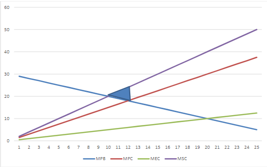

##### Problem 1 Peak Load Pricing for Electricity

Imagine a market where demand for electricity is characterized by $Q^p = 20-P^p$ in peak periods and $Q^O = 8-2P^O$  in off-peak periods. Both the peak period and the off-peak period take up half of each day. The variable cost per unit of output per period is 0.5. Capital costs, which are sunk and cannot be adjusted between periods, are 0.75 per unit of capacity per day. 

a. If peak and off-peak pricing is allowed, what is the optimal capacity, peak price and off-peak price? 

- $P^p = var.cost + capital.cost = 0.5+0.75 = 1.25$

  $Q^p = 20-P^p = 20-1.25 = 18.75$

  $K (capacity) = Q^p = 18.75$

  

  $P^O = var.cost = 0.5$

  $Q^O = 8-2P^O = 8-2(0.5) = 7$

- Since peak and off-peak demand occur during different periods, there will be idle capacity (capacity exceeds demand) during off-peak hours.

  

b. If only one price can be charged throughout the day, what price and capacity would maximize social surplus? 

- $TS = CS^O + CS^P + PS$

  $CS^O = \frac{1}{2}(4-P)Q^O$

  - when P = 4 Q  = 0, $CS = (1/2)(P_{max}-P)Q$

  $CS^O = \frac{1}{2}(4-P)(8-2P)$

  $CS^P = \frac{1}{2}(20-P)(20-P)$

  

  $PS = PQ^P+PQ^O-TC$, $TC = 0.5(Q^O+Q^P)+0.75(Q^P)$

  $PS = P(20-P)+P(8-2P)-0.5(8-2P+20-P)-0.75(20-P) $

  ​		$= -3P^2+30.25P-29$

  $TS = CS^O + CS^P + PS = \frac{1}{2}(4-P)(8-2P)+\frac{1}{2}(20-P)(20-P) + (-3P^2+30.25P-29)$

  ​		$ = -1.5P^2+2.25P+187$

  $TS_{max} = \frac{\part TS}{\part P} = -3P+2.25 = 0$

  $P = 0.75, \space Q^P = 20-0.75 = 19.25, \space K = 19.25,\space Q^O = 8-2(0.75) = 6.5$

  

##### Problem 2 Externalities  

Suppose that the market demand and supply for a private good ($Q$) are given by the following expressions:

$MPB(Q) = 30-\frac{1}{2}Q$ 

&

$MPC(Q) = \frac{3}{4}Q$ 

Assume no externalities arise from the consumption of the private good (i.e. $MSB(Q) = MPB(Q)$). However, the production of the private good does result in a negative externality in the form of pollution. Assume that the pollution created is directly proportional to the amount of 𝑄 produced – that means that the only way to reduce pollution is to reduce output. The total external cost from the production of 𝑄 is given by the following expression:

$TEC(Q) = \frac{1}{8}Q^2$

a. What is the competitive (unregulated) level of output  ($Q^c$)?

- In the unregulated market production and consumption will occur until the marginal private costs is equal to the marginal private benefit. Solving for the competitive outcome:

  $MPB(Q^c) = MPC(Q^c)$

  $30-\frac{1}{2}Q^c = \frac{3}{4}Q^c$

  $30 = \frac{5}{4}Q^c$

  $Q^c = 24$

b. What is the socially optimal level of output ($Q^*$)

- At the socially optimal level of output marginal social benefits will equal marginal social costs. Solving for the socially optimal: 

​	$MSC(Q) = MPC(Q)+MEC(Q) = Q$

​	$MSB(Q^*) = MSC(Q^*)$

​	$30-\frac{1}{2}Q^* = Q^*$

​	$30=(\frac{3}{2})Q^*$

​	$Q^* = 20$

c. Calculate the deadweight loss in the unregulated market relative to the social optimal level of output. 

- In the absence of government intervention, firms will produce too much electricity. Beyond $Q^*$, the social marginal cost of electricity exceeds the marginal benefit of electricity. Using calculus, you could directly solve for $TS(Q^*)$ and $TS(Q^c)$ and take the difference 

  $TS(Q^C) = \int_{0}^{24}(30-\frac{1}{2}Q-Q)dQ = 30(24) - (\frac{3}{4})(24^2) = 288$

  $TS(Q^*) = \int_{0}^{20}(30-\frac{1}{2}Q-Q)dQ = 30(20) - (\frac{3}{4})(20^2) = 300$

  $TS(Q^*) - TS(Q^C)=12$

  Or you could algebraically solve for the DWL by taking the area denoted below. Note that the height is given by the difference between MSC and MSB at the competitive equilibrium. 

​		$DWL = \frac{1}{2}(24-20)(6) = 12$

