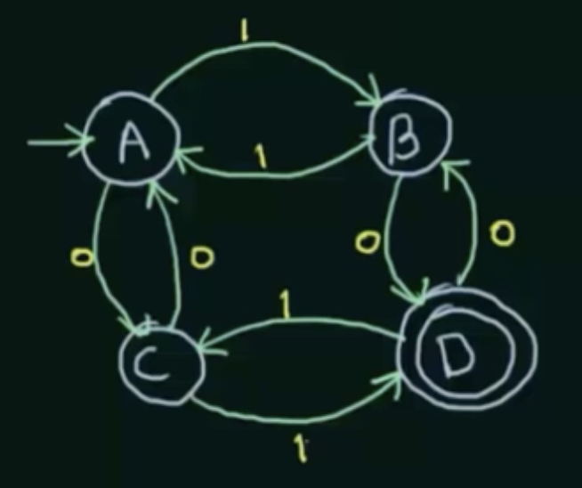

⭕️是state

➡️是inputs

➡ comes from nowhere points to the start state

double ⭕️是end state

Every DFA can be defined using five **tuples** which are

 $(Q, \Sigma, q_0, F,\delta )$

$Q$: Set of all states

$\Sigma$ : inputs

$q_0$: start state

$F$: set of final states

$\delta$: transition function from $Q \times \Sigma \rightarrow Q$

$Q = \{ A,B, C, D\}$

$\Sigma = \{0,1\}$

$q_0 = A$

$F = \{D\}$

$\delta = $

|      | 0    | 1    |
| ---- | ---- | ---- |
| A    | C    | B    |
| B    | D    | A    |
| C    | A    | D    |
| D    | B    | C    |

