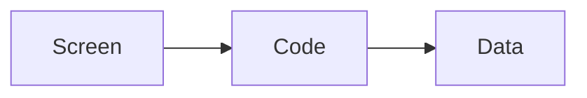

##### How does App work?

##### How to built an App

- Step 0 - Why
- Step 1 - Idea
- Step 2 - Design
- Step 3 - Development
- Step 4 - Test
- Step 5 - Publish
- Step 6 - Market
- Step 7 - Update

Always think about whether if you actually need to make an app before you make any app.