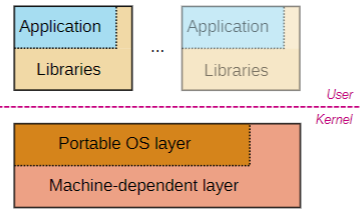
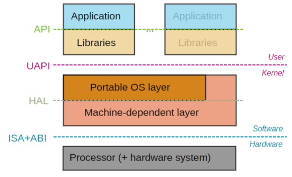

[toc]

#  4/14 Lecture

### Recap

##### File characteristics

- stat()/fstat(): information about file
- getcwd()/chdir(): access the current working directory
- opendir()/closedir()/readdir(): access the entries of a directory

##### Pipes

- Typically used to chain processes to one another and create complex commands
  - Example: get three biggest items within current directory

```bash
$ du -sh * | sort -h -r | head -3
...
```


### Signals

##### Definition

- Form of inter-process communication (IPC)
- Software notification system
  - From process' own actions: e.g., `SIGSEGV` (Segmentation fault)
  - From external events: e.g., `SIGINT` (Ctrl-C)
- About 30 different signals (see `man 7 signal`)

##### Default action

In case process does not define specific signal handling

- Terminate process: e.g., `SIGINT`,` SIGKILL`*
- Terminate process and generate core dump: e.g., `SIGSEGV`
- Ignore signal: e.g., `SIGCHLD`
- Stop process: e.g., `SIGSTOP`*
- Continue process: e.g., `SIGCONT`

##### Handling or ignoring

- Possible to change default action (but not for all signals!)`* signal cannot be changed.`

  `We could set to ignore SIGINT`

- Ignore signals

  - Mask of blocked signals

- Set signal handlers

  - Function to be run upon signal delivery

##### Main related functions/syscalls

- Sending signals
  - `raise()`: Send signal to self
  - `kill()`: Send signal to other process
  - `alarm()/setitimer()`: Set timer for self
    - Receive signal (`SIGALRM/SIGVTALRM`) when timer is up
- Blocking signals
  - `sigprocmask()`: Examine or change signal mask
  - `sigpending()`: Examine pending blocked signals
- Receiving signals
  - `sigaction()`: Map signal handler to signal
    - Also `signal()` but not recommended
  - `pause()`: Suspend self until signal is received

###### Example

```c
void alarm_handler(int signum)
{
		printf("\nBeep, beep, beep!\n");
}
int main(void)
{
    struct sigaction sa;
    sigset_t ss;
  
    /* Ignore Ctrl-C */
    sigemptyset(&ss);
    sigaddset(&ss, SIGINT);
    sigprocmask(SIG_BLOCK, &ss, NULL);
  
    /* Set up handler for alarm */
    sa.sa_handler = alarm_handler;
    sigemptyset(&sa.sa_mask);
    sa.sa_flags = 0;
    sigaction(SIGALRM, &sa, NULL);
  
    /* Configure alarm */
    printf("Alarm in 5 seconds...\n");
    alarm(5);
  
    /* Wait until signal is received */
    pause();
  
    /* Bye, ungrateful world... */
    raise(SIGKILL);
  
    return 0;
} 
// signal.c
```


###### Result

```bash
$ ./signal
Alarm in 5 seconds...
^C^C^C^C(Trying to end program)
Beep, beep, beep!
zsh: killed 	./signal
```


### Memory management

#### Division of labor

##### User C library

- `malloc()/free()` for dynamic memory allocation
  - **Heap** memory segment (at the end of **data** segment)
- Fine-granularity management only
  - When heap is full, syscall to kernel to request for more

##### OS/Kernel

- Memory management at "page" level
- Allocation of big chunks (many pages) to user library

#### Related functions/syscalls

- `sbrk()/brk()`
  - Linear increase of data segment
  - **Old** way of allocating heap space
  - Legacy function now

- `mmap()`
  - Map pages of memory in process' address space
  - Can also map a file's contents
  - Extremely versatile and powerful function

```c
#include <fcntl.h>
#include <signal.h>
#include <stdio.h>
#include <stdlib.h>
#include <sys/types.h>
#include <sys/stat.h>
#include <unistd.h>

void sigint_handler(int signum)
{
	printf("Let's resume!\n");
}

int main(void)
{
	int fd_file, fd_pipe[2];
	char buf[256];

	/* Set signal handler for SIGINT (Ctrl-C) */
	signal(SIGINT, sigint_handler);

	/* First pause */
	printf("Check usual file descriptors\n");
	pause();

	/* Now, let's add some new file descriptors */
	fd_file = open("log_err.txt", O_CREAT | O_RDWR, 0644);
	pipe(fd_pipe);

	/* Second pause */
	printf("Check with additional file descriptors\n");
	pause();

	/* Now, let's make a few changes */
	dup2(fd_pipe[0], STDIN_FILENO);
	dup2(fd_file, STDERR_FILENO);

	close(fd_pipe[0]);
	close(fd_file);

	/* Third pause */
	printf("Check after modifying file descriptors\n");
	pause();

	/* Test our weird scenario */
	write(fd_pipe[1], "Hello!\n", 8);
	fgets(buf, 256, stdin);
	printf("We received something, printing it to stderr!\n");
	fprintf(stderr, "%s", buf);

	return 0;
}

// file_descriptors.c
```


## 04. OS Structure

### OS Layers: overview


##### Applications

- User function calls
- Written by programmers
- Compiled by programmers

##### Libraries

- Definition
  - Via standard headers (e.g., `stdio.h, stdlib.h, math.h`)
  - Used like regular functions
- Declaration
  - Pre-compiled objects (e.g., `libc.so.6, libc.a, libm.so`)
  - Input to linker (e.g., `gcc -lc -lm`)
- Code inclusion
  - Included in executable directly (e.g., `gcc -static`)
  - Or resolved at load-time

#### All about applications + libraries

##### Application compilation


GCC can pre-process, compile, assemble and link together

- Preprocessor (`cpp`) transform program before compilation 
- Compiler (`cc`) compiles a program into assembly code
- Assembler (`as`) compiles assembly code into relocatable object file
- Linker (`ld`) links object files into an executable

```bash
$ % gcc hello.c -o hello -save-temps
$ % ll
```


# 4/17 Lecture (Missed)

### Recap

##### OS structure: application/libraries

- Applications
  - Written/compiled by programmers
- Libraries
  - Definition in header files
  - Declaration in precompiled objects
  - Included in executable or resolved at load-time

##### Compilation

- cpp: preprocessor
- cc: compiler
- as: assembler
- ld: linker


### All about applications + libraries

##### Application loading 101


###### Directly from executable

- Code (a.k.a. text)
  - Instructions
- Data
  - Global variables

###### Created at runtime

- Stack
  - Local variables
- Heap
  - `malloc()` area

###### Segment characteristics

- Separate code and data for permissions and sharing reasons

- Maximize space for stack/heap

  `They grow from both size, to one another`

##### Application dynamic loading

`How we load the library`

- By default, loader dynamically prepares application for execution
  - *(unless compiled with `-static`)*
  - Loaded before the application by the kernel
  - Read the executable file, and lays out the code, data (using syscalls)
  - Dynamically links to shared libraries

```bash
$ ldd a.out
		libc.so.6 => /usr/lib/libc.so.6 (0x00007fab5382b000)
		/lib64/ld-linux-x86-64.so.2 (0x00007fab53bc9000)
```


##### Static and dynamic libraries

```c
#include <math.h>
#include <stdio.h>
int main(void)
{
    printf ("%f\n", cos(2.0));
    return 0;
}
```

###### Dynamic

```bash
$ gcc main.c -lm
$ ldd a.out
    libm.so.6
    libc.so.6
    /lib64/ld-linux-x86-64.so.2 //lodaer
$ ./a.out
	-0.416147
```

- Math code will be loaded upon execution, by loader

###### Static

```bash
$ gcc main.c /usr/lib/libm-2.28.a
$ ldd a.out
    libc.so.6
    /lib64/ld-linux-x86-64.so.2
$ ./a.out
	-0.416147
```

- Math code is inserted as part of the executable at compile time

##### Dynamically loaded libraries

```c
#include <dlfcn.h>
#include <stdio.h>
int main(void)
{
    void *handle;
    double (*cosine)(double);
    char *error;
    
    handle = dlopen("/lib/libm.so.6", RTLD_LAZY);
    
    if (!handle)
   		return 1;
    
    cosine = dlsym(handle, "cos");
    
    if (!cosine)
    	return 1;
    printf ("%f\n", (*cosine)(2.0));
    
    dlclose(handle);
    return 0;
}
```

```bash
$ gcc main.c -ldl
$ ldd a.out
    linux-vdso.so.1
    libdl.so.2
    libc.so.6
    /lib64/ld-linux-x86-64.so.2
$ ./a.out
    -0.416147
```

`The application no longer need as dependencies`

- Math code is neither part of the executable, nor is it referenced
- Loaded at runtime only if specific code is executed
  - Handle case where library doesn't exist
  - Great for managing plugins!


#### OS Layers: details



`Android/Desktop Linux are both Linux. The protable OS layer is same.`

##### Portable OS layer

- Implementation of most system calls
- *High-level* kernel code (i.e., top-half) for most subsystems
  - Virtual File System (VFS)
  - Inter-Process Communication (IPC)
  - Process scheduler
  - Virtual memory
  - Networking, Sound, Cryptography, etc.

`The phone and desktop are different on Machine-dependent layer`

##### Machine-dependent layer

- Bootstrap
- System initialization
- Exception handler (exceptions, interrupts and syscalls)
- I/O device drivers
- Memory management
- Processor mode switching
- Processor management


#### OS Interfaces



- **API** (Application Programming Interface): interface between pieces of code
- **UAPI** (User API): syscall interface between apps and kernel
- **HAL** (hardware-abstraction layer), interface inside kernel between arch-independent code and arch-dependent code
- **ISA** (Instruction Set Architecture): list of processor instructions
- **ABI** (Application Binary Interface): interface between code and processor


#### Kernel structure

##### Monolithic kernel


###### Concept

- Entire kernel code linked together in a single large executable
- System call interface between kernel and applications

###### Examples

- GNU/Linux
- Unix
- BSD
- Windows 9x

###### Pros and cons

- Great performance

- But increased potential for instability

  - Crash in any function brings the whole system down
  - `kernel panic`

  

##### Microkernel


`The kernel executeable will only contain the minimum necessary`

`Like IPC, scheduler, memory management`

`File system, device, drivers, networking, will be part of the external services`

`Application ask micro-kernel, kernel ask services, services return to MK, Mk return to application`

###### Concept

- Most kernel services implemented as regular user-space processes
- Microkernel communicates with services using message passing

###### Examples

- Minix
- Mach
- L4

###### Pros and cons

- Great fault isolation
- But inefficient (boundary crossings)


##### Hybrid kernel


`Combine the advantage for previous kernel structures`

###### Concepts

- Trusted OS services implemented in kernel
- Non-trusted OS services implemented as regular user-space processes
- Best of both worlds?

###### Examples

- Windows NT
- macOS

###### Pros and cons

- Monolithic kernel for the most part
- But user-space device drivers


##### Linux Kernel

###### Simplified internal structure


# 4/19 Lecture

### 05. The Kernel Abstraction

##### Process abstraction

###### Process definition

- A process is a program in execution

  

  `Program is not 1:1 relationship to Process`

##### Lack of protection

- Multiple processes can be loaded in memory and run concurrently

###### Issues

- Buggy process
  - Crash other processes
  - Crash the OS
  - Hog all the resources
- Malicious process

###### Solution

- Redefine process abstraction
- Include notion of protection


##### Process RE-definition

-  A process is a program in execution, running with limited rights

###### Protected execution

- Memory segments process can access
- Other permissions process has
  - E.g., what files it can access
  - Based on process' user ID, group ID


###### But efficient

- Restricting rights must not hinder functionality
- Efficient use of hardware
- Communication with OS and between processes is safe

##### Limited priviledge execution

###### Interpreted execution

- Basic model in interpreted languages
  - Javascript, Python, etc.
- Emulate each program instruction
  - If instruction is permitted, then perform it
  - Otherwise, stop process
- But execution quite slow...

`I drive the car to take my friend around `


###### Native execution

- Run unprivileged code directly on the CPU
  - Very fast execution
- But safe execution needs specific hardware support...


`Your friend might crash your car.`


#### Dual-mode operation

##### Concept

- Distinct execution modes supported directly in hardware
  - Indicated by a bit in processor status register (e.g., 0 or 1)
  - *Can be more than one mode on some processor architectures*

###### Kernel mode

- Execution with full privileges on the hardware
  - Read/write to any memory location
  - Access to any I/O device
  - Read/write to any disk sector
  - Send/receive any packet
  - Etc.

###### User mode

- Limited privileges on the hardware
  - As granted by the operating system


##### Hardware support

###### Privileged instructions

- Potentially unsafe instructions prohibited when in user mode
- Only available in kernel mode
  `example: shut-down instruction. WFI(wait for interrupt) on RISC-V.`

###### Memory protection

- Memory accesses outside of process' memory limits prohibited
- Prevent process from overwriting kernel's or other processes' memory

###### Timer interrupts

- Kernel periodically regains control on CPU
- Prevent running process from hogging hardware

###### Mode switch

- Safe and efficient way to switch mode
- From user mode to kernel mode, and vice-versa

##### 

##### Typical 5-stage pipeline (Not on Exam)


`add $4, $5, $6`


##### "Dual-mode" 5-stage pipeline


##### Privileged instructions

###### Definition

- Instructions only available to code running in kernel mode
- Processor exception if user code tries to execute privileged instruction10 / 24

###### Example

```c
int main(void)
{
    printf("Hello!\n");
  
    /* Try deactivating
    * hardware interrupts */
  
    asm ("cli" ::: "memory");
  
    while (1)
    		printf("I win?\n");
  
    return 0;
}
// x86_cli.c
```

Output

```bash
$ ./x86_cli
Hello!
Segmentation fault (core dumped)
```

`Illegal instructions are reported as segmentation faults on x86/Linux`

###### And more...

- Toggle processor mode
- Modify memory protection
- Flush/invalidate caches/TLBs
- Halt or reset processor
- Etc.

##### Memory Protection

###### Concept

- Enforce memory boundaries to processes
- Processor exception if code tries to access unauthorized memory

###### Basic segmentation

- Memory area defined by base and bound pair


###### Virtual memory

- Runtime translation between virtual and physical address spaces


##### Timer interrupts

###### Boot sequence

- Upon powering on the computer
  - Privilege mode set to kernel mode
  - PC set to address of boot code (e.g., BIOS)
- Boot code runs
  - Loads kernel image into memory
  - Jumps to kernel's entry point
- Kernel code runs
  - Machine setup (devices, virtual memory, interrupt vector table, etc.)
  - Chooses the first user process to run, loads it, and jumps to it
    - Privilege bit set to user mode
    - PC set to process' entry point
- First process runs
  - Need a way for kernel to re-take control...


##### Timer interrupts

###### Hardware timer

- Periodically interrupts the processor
  - Frequency of interruption set by the kernel
  - Returns control to the kernel exception handler
- Also typically used to maintain accurate and precise time of day


```bash
sshell$ ls file_that_doesnt_exists >& output
+ completed 'ls file_that_doesnt_exists >& output' [2]
sshell$ cat output
ls: cannot access 'file_that_doesnt_exists': No such file or directory
+ completed 'cat output' [0]
sshell$ ls file_that_doesnt_exists |& wc -l
1
+ completed 'ls file_that_doesnt_exists |& wc -l' [2][0]
sshell$
```


# 4/21 Lecture

### Recap

#### Process abstraction, v2.0

##### Protected execution


##### Native execution


#### Dual-mode operation

##### User mode vs kernel mode


##### Hardware support

- Privileged instructions
- Memory protection
- Timer interrupts
- Mode switch

### Mode switching

#### User mode to kernel mode `ONLY 3 REASONS`

##### Exceptions (or faults) `Program caused exceptions`

- Triggered by program behavior
- Intentional or unintentional `If you write a code by a mistake, it's unintentional / Intentional like you a hacker`
- Synchronous events

```c
// Execution of privileged inst
asm ("cli" ::: "memory");
```

```c
// Dereferencement of NULL ptr
int *a = NULL;
*a = 42;
```

##### Interrupts

- Triggered by **I/O devices**
  - E.g., timer, hard-drive, etc.
- (Better) alternative to *polling* `Polling: keep asking are you done?`
- Asynchronous events


##### System calls

- Request from process to kernel to perform operation on its behalf
- Intentional, synchronous events

```assembly
read:
    movq $SYS_read, rax
    movq $fd, rdi
    movq $buf, rsi
    ...
    syscall
```


#### Kernel mode to user mode `Why kernel switch to user?`

##### Return from interrupt or system call

- Resume suspended execution of same process


##### Process context switch

- Resume some other process

  

##### New process start

- Jump to first instruction of program


##### Signal

- Asynchronous notification
- If signal handler defined


#### Safe and efficient switching

- Protect from corrupting the kernel
  - Entry door to the kernel for processes
- Reduce overhead of kernel
  - Maximize CPU cycles for processes 

##### Requirements

1. Atomic transfer of control
2. Exception vector
3. Transparent, restartable execution


#### 1. Atomic transfer of control

- Safe transition between modes must be atomic

  - i.e., in one *unbreakable*, logical step

- CPU mode, PC, stack, memory protection, etc., changed at "the same time"

  `Like change the driver when driving:  need to stop the car, park gear ....`

##### User to kernel switch `Steps`

- Save cause for jump 
  - Interrupt, Exception, Syscall?
- Save current PC
- Jump to kernel entry point(s)
- Switch from user to kernel mode
- Change memory protection
- Disable interrupts


##### Kernel to user switch `Steps (like reverse)`

- Jump (back) to process (restore PC)
- Switch from kernel to user mode
- Change memory protection
- Restore interrupts


#### 2. Exception vector

- Provide limited number of entry points into the kernel
- Table set up by kernel: function pointers to exception handlers

###### Example MIPS processor

```c
/* Exception vector init */
exception_vector[0] = handle_int;
exception_vector[8] = handle_sys;
exception_vector[10] = handle_ri;
...
```

##### Software-managed

- Single kernel entry point for CPU
  - Fixed or configurable address
- Software dispatch based on exception cause

###### Example MIPS processor

```assembly
exception_entry: # Kernel entry point
    # Retrieve cause from system register
    mfc0 	k1, CP0_CAUSE
    # Extract exception code
    andi 	k1, k1, 0x7c
    # Use code as index in array
    lw 		k0, exception_vector(k1)
    # Jump to proper handler
    jr 		k0
```

##### Hardware-managed

- CPU aware of vector
- Automatic hardware dispatch


#### 3. Transparent, restartable execution

- Processes should never know when they are interrupted
- Save/restore execution context (processor registers) 

##### Software-managed

```assembly
handle_int:
		# Switch to kernel stack (not shown)
...
    # Save all registers
    sw $1, 4(sp)
    sw $2, 8(sp)
    sw $3, 12(sp)
...
    # Jump to C function
    # that processes interrupt requests
    jal do_irq
    
    # Restore all registers
...
    lw $3, 12(sp)
    lw $2, 8(sp)
    lw $1, 4(sp)
    
# Jump back to process
    eret
```

##### Hardware-managed

- Processor saves all the registers in a provided memory region
  - Task state segment (TSS) on x86 processors
- Rarely used in practice
  - E.g., not used by Linux or Windows


### Kernel stack

#### Definition

- Kernel has its own stack, located in kernel memory
- Different from process' stack


#### Context saving

- Kernel stack is used to save associated process context


- Not a good idea to reuse process's stack pointer
  - Reliability: no guarantee user stack is valid
  - Security: kernel data shouldn't leak to user space


#### One kernel stack per process

- Kernel saves its own state when switching between two processes


# 4/24 Lecture

## 06.Process-scheduling

#### Process


##### Definition (recap)

- A process is the abstraction used by the OS to execute programs
- Comprehensive set of features
  - Protection against other processes
  - Isolation from OS/kernel
  - Intuitive and easy-to-use interface (syscalls) `(U)API`
  - Portable, hides implementation details
  - Can be instantiated many times
  - Efficient and reasonable easy to implement

###### Characteristics

1. Address space
2. Environment
3. Execution flow

##### Address space

-  Each process has its own memory address space

```c
int i = 1;	/* data */

int main(void)
{
    int j = 10; /* Stack */
    int *k = malloc(sizeof(int)); /* Heap */
  
    *k = 4;
  
    if (fork()) {
      /* Parent */
        i = i + 1;
        j = j - 1;
        *k = *k * 1;
    } else {
      /* Child */
        i = i + 2;
        j = j - 2;
        *k = *k * 2;
    }
  
    printf("i=%d, &i=%p\n", i, &i);
    printf("j=%d, &j=%p\n", j, &j);
    printf("k=%d, &k=%p\n", *k, &k);
  
    return 0;
}
```

11:52

###### Output

```bash
$ ./address_space
i=2, &i=0x5634b1f6f048
j=9, &j=0x7ffc70ffaaec
k=4, &k=0x7ffc70ffaaf0
i=3, &i=0x5634b1f6f048
j=8, &j=0x7ffc70ffaaec
k=8, &k=0x7ffc70ffaaf0
```


##### Environment


- Defined in PCB
- Determines all the specific characteristics of a process
  - Process ID, Process group ID
  - User ID, Group ID
  - Link to parent process
  - Locations of memory segments
    - text, data, stack, heap
  - Open file tables
  - Working directory
  - Process state
  - Scheduling parameters
  - Space for saved context
    - PC, SP, general-purpose registers
  - Etc.

##### Execution flow

- Single sequential execution stream
  - Statements executed in order
  - Can only be at one location in the code at a time
- Can only be (slightly) disrupted by signals

```c
void sig_hndl(int signo)
{
    statement#1;
    statement#2;
    ...
    statement#N;
}
int main(void)
{
    statement#1;
    statement#2;
    statement#3;
    statement#4; // If statement #4 is a syscall
    statement#5;
    ...
    statement#N;
}
```


`Timer interrupt?`


#### Scheduling concepts

##### Definition

- Single-processor systems only allow one process to run at a time
- Scheduler in charge of determining which process should run
  - Ready queue contains all processes ready to run


##### CPU-I/O burst cycles

```c
int main(void) {
    int fd;
    int i;
    char *buf = malloc(4 * 1024 * 1024); /* 4 MiB */
  
    fd = open("input.txt", O_RDONLY); /* I/O burst */
    read(fd, buf, sizeof(buf));
    close(fd);
  
    for (i = 0; i < sizeof(buf); i++) { /* CPU burst */
      if (isupper(buf[i]))
        buf[i] = tolower(buf[i]);
  }
  
    fd = open("output.txt", O_RDONLY); /* I/O burst */
    write(fd, buf, sizeof(buf));
    close(fd);
  
    return 0;
}
```

###### CPU-bound vs I/O-bound

- CPU-bound processes (e.g., scientific calculations)
- I/O-bound processes (e.g., BitTorrent)
- Mix CPU-I/O-bound processes (e.g., compiler)


##### Multitasking

- Goal of maximizing CPU utilization among multiple processes
- When process is performing I/O burst, give CPU to *next* available process
- Scheduling policy determines which process is **next**

###### Cooperative

- Process can hold unto CPU during long CPU bursts
- Only yields voluntarily, or during I/O bursts

```c
int main(void)
{
    for () { /* CPU burst */
      	...
}
    sched_yield(); /* Yield CPU */
    scanf(); /* I/O burst */
    ...
}
```

###### Preemptive

- Process can be forcefully suspended, even during long CPU bursts
- Use of hardware timer interrupts
- Ensures guarantee in CPU sharing between multiple processes

```c
int main(void)
{
    for () { /* CPU burst */
    		...
	}
    scanf(); /* I/O burst */
    ...
}
```


##### Process lifecycle


###### Process states

- Ready
- Running
- Blocked
- Zombie

###### Orphaned processes

- Special scenario if parent's process terminates before process
- Depends on whether process is running from terminal or not
  - Delivery of `SIGHUP` signal or *reparenting*


# 4/26 Lecture

#### Recap

##### Process

- Address space
  - Each process has it own address space
- Environment
  - Mostly represented by OS' PCB
- Execution flow
  - Single sequential execution stream

##### Scheduling concepts

- Share processor resource among *ready* processes
- CPU bursts vs IO bursts
  - CPU-bound vs IO-bound processes

```c
/* I/O burst */
fd = open("input.txt", O_RDONLY);
read(fd, buf, sizeof(buf));
close(fd);

/* CPU burst */
for (i = 0; i < sizeof(buf); i++) {
    if (isupper(buf[i]))
   		 buf[i] = tolower(buf[i]);
}
```

- Cooperative vs preemptive

##### Process Lifecycle

 


#### Scheduling algorithms

##### Vocabulary


- **Submission time**: time at which a process is created
- **Turnaround time**: total time between process submission and completion
- **Response time**: time between process submission and first execution or first response (e.g., screen output, or input from user)
- **Waiting time**: total time spent in the ready queue


##### FCFS (or FIFO)

- First-Come, First-Served
- Most simple scheduling algorithm (e.g., queue at DMV)

###### Example 1 (the good)

| Task | Submission | Length |
| ---- | ---------- | ------ |
| A    | 0          | 10     |
| B    | 0          | 10     |
| C    | 0          | 10     |


- Avg turnaround time: (10+20+30)/3 = 20

###### Example 2 (the bad)

| Task | Submission | Length |
| ---- | ---------- | ------ |
| A    | 0          | 100    |
| B    | 0          | 10     |
| C    | 0          | 10     |


- Avg turnaround time: (100+110+120) / 3 = 110
- Problem known as *convoy effect*


##### SJF

- Shortest Job First 
- *Optimal scheduling* but requires to know task lengths in advance 
  - Use predictions instead (based on past behavior)

###### Example 1 (the good)

| Task | Submission | Length |
| ---- | ---------- | ------ |
| A    | 0          | 100    |
| B    | 0          | 10     |
| C    | 0          | 10     |


- Avg turnaround time: (10+20+120) / 3 = 50

###### Example 2 (the bad)

| Task | Submission | Length |
| ---- | ---------- | ------ |
| A    | 0          | 100    |
| B    | 10         | 10     |
| C    | 10         | 10     |


`A shows up before B and C.`

- Avg turnaround time: (100+100+110) / 3 = 103.33
  - `A turnaround time = 100, B turnaround time = 100, C turnaround time = 110`


##### Preemptive SJF

- Also known as SRTF (Shortest Remaining Time First)
- New shorter jobs can interrupt longer jobs

###### Example (the good)

| Task | Submission | Length |
| ---- | ---------- | ------ |
| A    | 0          | 100    |
| B    | 10         | 10     |
| C    | 10         | 10     |

- Avg turnaround time: (120+10+20) / 3 = 50

###### Example 2 (the bad)

| Task | Submission | Length |
| ---- | ---------- | ------ |
| A    | 0          | 100    |
| B    | Every 20   | 10     |
| C    | Every 20   | 10     |


`When there are hundreds of shampoo buyer after A`

- Can lead to *starvation*
- Avg turnaround time: ???


##### Turnaround time vs response time

- Optimizing for **turnaround time** great for (old) batch systems
  - Length of tasks known (or predicted) in advance
  - Tasks mostly CPU-bound
- With interactive systems, need to optimize for **response time**
  - User wants reactivity `When you push the button, you want it to react not freezing.`
  - Tasks of unknown length

###### SJF (again)

| Task | Submission | Length |
| ---- | ---------- | ------ |
| A    | 0          | 10     |
| B    | 0          | 10     |
| C    | 0          | 10     |


- Avg turnaround time: (10+20+30) / 3 = 20
- Avg response time: (0 + 10 + 20) / 3 = 10


##### Round-robin (RR)

- Tasks run only for a (short) time slice at a time	`2.5 seconds`
- Relies on preemption (via timer interrupts)

| Task | Submission | Length |
| ---- | ---------- | ------ |
| A    | 0          | 10     |
| B    | 0          | 10     |
| C    | 0          | 10     |


- Avg turnaround time: (25+27.5+30) / 3 = 27.5
- Avg response time: (0 + 2.5 + 5 ) / 3 = 2.5

###### Characteristics

- Prevents starvation
- Time slice duration matters
  - Response time vs context switching overhead
- Poor turnaround time


##### Multi-level queue scheduling `Hybrid`

- Classify tasks into categories
  - E.g., *foreground* (interactive) tasks vs *background* (batch) tasks
- Give different priority to each category
  - E.g., Interactive > batch
- Schedule each categorize differently
  - E.g., optimize for response time or turnaround time


`System Process > Interactive Processes(Chrome, Firefox...) > Batch Processes (GCC process..)`

- Characteristics
  - Adapt to each task's type
  - More flexible than strict FCFS, SJF, or RR algorithm
  - Potential starvation issues


##### Multi-level feedback queue

- No predetermined classification
  - All process start from highest priority
- Dynamic change based on actual behavior
  - CPU-bound processes move to lower priorities
  - I/O-bound processes stay at or move up to higher priorities


`Can move up or move down`

###### Characteristics

- Responsiveness
- Low overhead
- Prevents starvation
  - Increase task's priority if not getting fair share
- Used in real OSes
  - Windows, macOS, Linux (old versions)


### 07. Concurrency-threads

#### Concurrency (并发)

##### Definition


- Concurrency is the composition of independently executing tasks
  - Tasks can start, run, complete in overlapping time periods
- Opposite to *sequential execution*

##### Process concurrency

- Decompose complex problems into simple(r) ones
- Make each simple one a process
- Resulting processes run *concurrently*


###### Example

- By default, gcc runs compilation tools sequentially, using intermediary files
- With option `-pipe`, gcc runs `cpp | cc1 | as | ld` (concurrently) `Just like the project 1 pipe`
  - Tools run concurrently as independent but cooperating processes


##### Types of concurrency

 

- Example of sequential execution
  - CPU and I/O bursts

###### CPU virtualization


- Processes interleaved on same CPU

###### I/O concurrency


- I/O bursts overlapped with CPU bursts
- Each task runs almost as fast as if it had its own computer
- Total completion time reduced

###### CPU *parallelism* (Not same as concurrency)


- Requires multiple CPUs `Only in more than 1 CPU`
- Processes running simultaneously
- Speedup


# 4/28 Lecture

### Concurrency Recap

- Process running at the same time.


#### Parallelism (short digression)

##### Real-life example

- Parallelism is common in real life
  - A single sales employee sells 1M dollar
  - Expectation that hiring another sales employee will generate $2M
    - Ideal speedup of 2

##### Seepdup

- Speedup should ideally be linear
- But more often *sublinear*...
  - Bottleneck in sharing resources, coordination overhead, etc.
- Quite rarely *superlinear*!
  - Caching effect, different algorithms


`CPU越多，单个效率越低`


#### Process concurrency limitations

- E.g., `gcc -pipe` => `cpp | cc1 | as | ld`
- Quite heavy for the OS to fork a process
  - Duplication of resources (address space, environment, execution flow)
- Slow context switch
  - E.g., some processor caches not shared between processes
- Difficulty to communicate between processes
  - Only IPCs, which all necessitate kernel intervention (syscalls)

##### Idea

- Eliminate duplication of the address space and most of the environment
- Place concurrent computations within the same address space


### Threads: introduction

#### Definition

- One or more **threads** per process (i.e., per memory address space)
- *Single execution sequence* that represents *a separately schedulable task*
  - Familiar programming model (sequential instruction of instructions)
  - Thread can be run or suspended at any time, independently from another
- Also known as *lightweight process* or *task*

###### Example (assuming kernel-level threads)


```c
int main(void) {
    statements;
    ...
    thread_create(threadA);
    thread_create(threadB);
    ...
}
void threadA(void) {
    statements;
    ...
}
void threadB(void) {
    statements;
    ...
}
```


#### Rationale

##### Problem structure

- We think linearly
- But the world is concurrent

##### Responsiveness

- One thread to maintain quick response with user
- Other thread(s) to execute longer tasks in the background, or block on I/O

##### Faster execution

- Threads scheduled across different processors in a multi-processor system
- Achieve true parallelism

##### Sharing and communication

- No need for heavy IPCs
- Use of shared memory


#### Example 1: Web server

##### Monothreaded process

```c
while (1) {
    uri = get_uri_from_req();
    data = read_from_disk(uri);
    resp = create_response(data);
    send_response(resp);
}
```


##### Multithreaded process

```c
void webserver(void) {
    while (1) {
        uri = get_uri_from_req();
        data = read_from_disk(uri);
        resp = create_response(data);
        send_response(resp);
    }
}
int main(void) {
    for (int i = 0; i < N; i++)
        thread_create(webserver);		
}
```


#### Example 2: Array computation

- Assuming N is huge
- And, assuming a dual-processor system...

##### Monothreaded process

```c
int a[N], b[N], c[N];

for (i = 0; i < N; i++)
		a[i] = b[i] * c[i];
```


##### Multi-threaded process

```c
void do_mult(int p, int m) {
    for (i = p; i < m; i++)
        a[i] = b[i] * c[i];
}
int main(void) {
    thread_create(do_mult, 0, N/2);
    thread_create(do_mult, N/2, N);
    ...
}
```


- Parallel computation
- Not achievable by process forking!


`What if instead of split into half, we put even number on CPU1 and odd number on CPU2?`

`- Conflict on cache level. (Since cache is going to store nearby elements)`


### Threads: characteristics

#### Execution context

- Threads have the exclusive use of the processor registers while executing
- Threads each have their own stacks
  - But no memory protection from other threads of the same process
- When a thread is preempted, the registers are saved as part of its state
  - The next thread gets to use the processor registers

#### Process environment

- All threads of a process share the same environment
  - Current working directory
  - User ID, Group ID
  - File descriptors
  - Etc.	

```c
void thread(void) {
    printf("hello\n");
    chdir("/");
}
int main(void) {
    char dir[PATH_MAX];
    ...
    dup2(STDOUT_FILENO, fd[1]);
    thread_create(thread);
    ...
    printf("%s", getcwd(dir, PATH_MAX));
    ...
}
```

#### Address space

- All process data can be accessed by any thread
  - Particularly global variables
  - Heap is also be shared (via pointers)

```c
int global, *a;

void thread(int arg) {
    int var = global + arg;
    *a = var;
}

int main(void) {
    global = 42;
    a = malloc(sizeof(int));
    thread_create(thread, 23);
    thread_create(thread, 42);
    ...
}
```

#### Metadata structures

- Process Control Block (PCB)
  - Process-specific information
  - PID, Owner, priority, current working directory, active thread, pointers to thread control blocks, etc.

- Thread Control Block (TCB)
  - Thread-specific information
  - Stack pointer, PC, thread state, register values, pointer to PCB, etc.


#### Differences between threads and processes (Threads vs. Process) (Optional Reading)

- Thread
  - Has no code or data segment or heap of its own. Only has its own stack and set of registers.
  - Cannot live on its own: must live within a process. There can be more than one thread in a process - the original thread calls main() and retains the process's initial stack.
  - If it dies, its stack is reclaimed.
  - Depending on implementation, each thread can run on a different physical processor. 
  - Communication between threads via implicit shared address space.
  - Inexpensive creation and context switch.
- Process
  - Has code/data/heap and other segments of its own. Also has its own registrs.
  - There must be at least one thread in a process. The thread that executes main() and uses the process's stack. 
  - If it dies, its resources are reclaimed and all its internal threads die as well.
  - Each process can run on a different physical processor.
  - Communication between processes through kernel-managed IPCs
  - More expensive creation and context switch.

# Lecture 5/1

### Recap

#### Concurrency

- Composition of independently executing task


- Opposite to sequential execution


#### Parallelism

- Specific type of concurrency
- Requires multiple CPUs	


#### Processes vs threads

- Process concurrency has limitations

  - Slow context switch, difficult to communicate

- Concurrent threads within same process

  - Easier communication, parallel computation

  `Multiple threads running in one process (more efficient)`


### Threads: models

#### API

Exact API varies depending on OS/library (e.g., POSIX pthreads)

```c
/* Thread function prototype */
typedef int (*func_t)(void *arg);

/* Create new thread and return its TID */
thread_t thread_create(func_t func, void *arg);

/* Wait for thread @tid and retrieve exit value */
int thread_join(thread_t tid, int *ret);

/* Yield to next available thread */
void thread_yield(void);

/* Exit and return exit value */
void thread_exit(int ret);
```

#### Implementation models

- Kernel-level threads (one-to-one)
- User-level threads (many-to-one)


##### Kernel-level threads (one-to-one)

- *Kernel-level threads* are threads which the OS knows about
  - Every process is composed of a least one kernel-level thread (`main()`)
- Kernel manages and schedules threads (along with processes)
  - System calls to create, destroy, synchronize threads
  - E.g., `clone()` syscall on Linux to create a new thread
- Switching between threads of same process requires a light context switch
  - Values of CPU registers, PC and SP must be switched
  - Memory protection remains since threads share the same address space


###### Single-threaded processes


###### Multi-threaded processes


###### Context switch procedure

- Thread A stops running
  - That is, blocks (I/O), is interrupted (timer), or voluntarily yields (syscall)
  - Mode switch to kernel mode
- OS chooses new thread *B* to run
- OS switches from *A* to *B*
  - Saves thread *A*'s state (save processor registers to A's TCB)
  - Restore new thread *B*'s state (restore processor registers from *B*'s TCB)
- OS returns to thread B
  - Mode switch to user mode
- New thread B is running


##### User-level threads (many-to-one) `Project 2`

- *User-level* threads are threads which the OS does not know about
  - OS only knows and schedules processes, not threads within processes
- Programmer uses a dedicated *thread library* to manage threads
  - Functions to create, destroy, synchronize threads
  - User-level code can define scheduling policy
- Switching between threads doesn't involve a (kernel-managed) context
  switch


###### Multi-threaded processes at user-level


###### Context switch procedure (sort of)

- Thread A is running
- Thread A voluntarily yields (function call)
- Library picks new thread B to run
- Library saves thread A's state (to A's custom TCB)
- Library restores thread B's state (from B's custom TCB)
- New thread B is running


###### Pitfall

- Whole process is blocked if one thread blocks on I/O
- `Kernel don't know the process is multithreading, so if one thread is blocked whole process is blocked`


### Differences between kernel- vs user-level threads

##### Kernel-level thread

Pros

- Blocking system calls suspend the calling thread only (I/O)
- Threads can run simultaneously on a multiprocessor system
- Signals can usually be delivered to specific threads
- Used by existing systems, e.g. Linux

Cons

- Can be heavy, not as flexible

##### User-level thread

Pros

- Really fast to create and switch between threads (no system calls or full context switches necessary)
  - May be an order of magnitude faster
- Customizable scheduler

Cons

- All threads of process are blocked on system calls
  - Can use non-blocking versions, if they exist
- Customizable scheduler

`Go uses kernel-level threads, and java uses user-level thread`


#### One abstraction, many flavors

1. Single-threaded processes
   - Traditional application model
   - Mapping 1:1 with kernel-level threads 


2. Multi-threaded processes with user-level threads
   - Threads are managed in user-space
   - Mapping M:1 with kernel-level threads
   - Thread management through function calls
   - Scheduled by user-space library scheduler
   - TCBs in user-space library data structures


3. Multi-threaded processes with kernel-level threads
   - Threads are managed by OS
   - Thread management through system calls
   - TCBs and PCBs in kernel
   - Scheduled by kernel scheduler


4. In-kernel threads (aka *kernel threads*)
   - The kernel itself can be multi-threaded
   - E.g., idle thread, thread migration, OOM reaper, disk writeback, etc.


### One more flavor: cooperative vs preemptive

#### Cooperative

- Threads run until they yield control to another thread (aka fibers)
  - The action of yielding is in the code itself
- Better control of scheduling
- Simpler reasoning about shared resources
- Can lead to potential starvation on mono-core machines
- Need to reason further for multi-core machines

#### Preemptive

- Threads are frequently interrupted and forced to yield
- Certain guarantee of fairness
- Scheduling is not deterministic
- Resource sharing needs to be resistant to preemption

##### Indeterministic scheduling


### POSIX threads

- POSIX 1003.1c (aka pthreads) is an API for multithreaded programming standardized by IEEE as part of the POSIX standards
- Multithreaded programs using pthreads are likely to run unchanged on a wide variety of UNIX-based systems

##### Interface

- Only defines the interface
  - user-space implementation
  - or kernel space implementation

```c
#include <pthread.h>
int pthread_create(pthread_t *thread, const pthread_attr_t *attr, 											void *(*start_routine)(void *), void *arg);
void pthread_exit(void *status);
int pthread_join(pthread_t thread, void **status);
pthread_t pthread_self(void);
int pthread_equal(pthread_t thread_1, pthread_t thread_2);
...
```


### Threads: pitfalls/issues

##### Forking

```c
void *thread_fcn(void *ptr)
{
    char *msg_thread = (char*)ptr;
    fork();
    printf("%s\n", msg_thread);
}
int main(void)
{
    pthread_t t1;
    char *msg_main = "Hello";
  
    pthread_create(&t1, NULL, thread_fcn,
   								 (void*)msg_main);
  
    pthread_join(t1, NULL);
  
    printf("Done!\n");
  
    return 0;
}
```

```bash
$ ./a.out
Hello
Hello
Done! # only one message prints done
```

- `fork()` only clones the calling thread
- Mixing multi-threading and forking is not recommended as it can lead to undesirable situations

##### Sharing

- Shared data structures and files

```c
int a;	// a = 0; at start
void *thread_fcn(void *ptr)
{
    a++;
}
int main(void)
{
    pthread_t t1, t2;
  
    pthread_create(&t1, NULL,
                   thread_fcn, NULL);
    pthread_create(&t2, NULL,
                   thread_fcn, NULL);
  
    pthread_join(t1, NULL);
    pthread_join(t2, NULL);
  
    printf("a=%d\n", a);
  
    return 0;
}
```

- May lead to surprising results...

```bash
$ ./a.out
a = 2
$ ./a.out
a = 1		# it is weird that a=1
```

- Will require use of synchronization mechanisms
- Will see that in next topic!	


##### Libraries

- Global variables and non-reentrant library functions

```c
void *thread_fcn(void *ptr)
{
    char *msg = (char*)ptr;
    char *p = strtok(msg, " ");
    while (p) {
        if (write(1, p, strlen(p)) == -1)
        		perror("write");	// multithreading sharing the global variable. Perror will return the global variable errno, which will messed up by global variable.
        p = strtok(NULL, " "); // Has a hidden global variable to track states. But multithreads sharing the global threads
    }
}
int main(void)
{
    pthread_t t1, t2;
    char msg1[] = "Thread #1";
    char msg2[] = "Thread #2";
  
    pthread_create(&t1, NULL, thread_fcn,
                   (void*)msg1);
    pthread_create(&t2, NULL, thread_fcn,
                   (void*)msg2);
		...
}
```

- Functions should be *reentrant*
  - e.g., `strtok_r()`
  - No shared context between threads
- Global variables: Thread Local Storage
  - C11 extension
  - `__thread int errno`;
  - Provides one global variable copy per thread


# 5/3 Lecture (Online)

## 08. ECS 150 - Synchronization

### Threads (recap)

#### Memory sharing

- Private processor registers
- Private stack
- Shared global memory

#### Type of sharing

##### Independent

- Threads work on distinct areas of shared data

```c
int a[N], b[N], c[N], d[N], e[N];

void do_mult(int p, int m)
{
    for (int i = p; i < m; i++)
      	a[i] += b[i] * c[i] + d[i] * e[i];
}
int main(void)
{
  ...
  thread_create(do_mult, 0, N/2);
  thread_create(do_mult, N/2, N);
  ...
}
```

##### Cooperating

- Threads work on same areas of shared data

```c
int a[N], b[N], c[N], d[N], e[N];

void do_mult_bc(void)
{
    for (int i = 0; i < n; i++)
    		a[i] += b[i] * c[i];
}
void do_mult_de(void)
{
    for (int i = 0; i < n; i++)
   		 a[i] += d[i] * e[i];
}
int main(void)
{
    ...
    thread_create(do_mult_bc);
    thread_create(do_mult_de);
    ...
}
```


### Concurrency issues

#### Example

```c
int x = 0;

void thread_a(void)
{
    x = x + 1;
}
void thread_b(void)
{
		x = x + 2;
}
int main(void)
{
    thread_create(thread_a);
    thread_create(thread_b);
    thread_join(thread_a);
    thread_join(thread_b);
    printf("%d\n", x);
    return 0;
}
```

#### Execution

- Typical output:

  ```bash
  $ ./a.out
  3
  ```

- Also possible (yet probably very rare)...

  ```bash
  $ ./a.out
  2
  $ ./a.out
  1
  ```

`Thread A might run a little bit on assembly code, and Thread B might take place and run a little bit... which messed up the process.`

### Concurrency issues

#### Indeterministic interleavings

##### Thread scheduling

- Indeterministic scheduling
- Sequential execution, concurrent execution, parallelism, etc.


##### Instruction reordering

- Compiler instruction reordering
- Hardware instruction reordering

```c
void thread1(void) {
    ...
    p = init();
    init = true;
    ...
}
void thread2(void) {
    ...
    while (init == false);
  			q = docomputation(p);
    ...
}
```

##### Multi-word operations

- Multi-word operations are not atomic

```c
// Assuming 32-bit CPU
uint64_t num = 2;
...
num = num + 1;
```


#### Race conditions

##### Definition

- **Race condition** when the result of a concurrent program depends on the order of operations between threads.

```c
void thread_a(void)
{
		x = x + 1;
}
```

```c
void thread_b(void)
{
		x = x + 2;
}
```

##### Difficulties

- Number of possible "interleavings" can be huge
- Some interleavings are good
  - Vast majority of them usually are
- Some interleavings are bad
  - They may even be extremely rare...

##### Solution?

- Synchronization!


### Too Much Milk!

#### Example

| Roommate 1                  | Roommate 2                  |
| --------------------------- | --------------------------- |
| Arrive home                 |                             |
| Look in fridge, out of milk |                             |
| Leave for store             |                             |
|                             | Arrive home                 |
| Arrive at store             | Look in fridge, out of milk |
| Buy milk                    | Leave for store             |
| Arrive home, put milk away  | Buy milk                    |
|                             | Arrive home, put milk away  |
|                             | Oh, no!                     |


##### Required correctness properties

- **Safety**: at most one person buys milk at a time
- **Liveness**: someone buys milk if needed


#### 1. Leaving a note

##### Roommate 1 (thread 1)

```c
if (note == 0) {
    if (milk == 0) {
        note = 1;
        milk++;
        note = 0;
    }
}
```

##### Roommate 2 (thread 2)

```c
if (note == 0) {
    if (milk == 0) {
        note = 1;
        milk++;
        note = 0;
    }
}
```

##### Safety and liveness

- Not safe if threads are descheduled right after the two tests
  - They would both put a note and get milk, resulting in two bottles of milk!


#### 2. Using two notes

##### Roommate 1 (thread 1)

```c
note1 = 1;
if (note2 == 0) {
    if (milk == 0) {
    		milk++;
    }
}
note1 = 0;
```

##### Roommate 2 (thread 2)

```c
note2 = 1;
if (note1 == 0) {
    if (milk == 0) {
    		milk++;
    }
}
note2 = 0;
```

##### Safety and liveness

- Not live if threads are descheduled right after setting their personal notes
  - They both think the other is on their way getting milk but no one eventually does


#### 3. Using asymmetric notes

##### Roommate 1 (thread 1)

```c
note1 = 1;
while (note2 == 1)
		;
if (milk == 0) {
		milk++;
}
note1 = 0;
```

##### Roommate 2 (thread 2)

```c
note2 = 1;
if (note1 == 0) {
    if (milk == 0) {
   		 milk++;
    }
}
note2 = 0;
```

##### Safety and liveness

- Yes, safe and live!


#### 3. Using asymmetric notes: explained

##### Issues

1. Way too over-engineered!
2. Asymmetrical, non-scalable
3. Involves busy-waiting

##### Peterson's algorithm

- Share a single resource using only shared memory
- Symmetric and scalable
- But still quite complex...
- [More here](https://en.wikipedia.org/wiki/Peterson%27s_algorithm)


### Critical section

#### Definition

- Piece of code where the shared resource is accessed
- Needs to be properly protected to avoid race conditions
- Cannot be executed by more than one thread at a time

##### Thread 1

```c
...
CS_enter();
		Critical section
CS_exit();
...
```

##### Thread 2

```c
...
CS_enter();
		Critical section
CS_exit();
...
```

##### Correctness properties

1. **Safety**
2. **Liveness**
3. Bounded waiting
4. Failure atomicity

##### Mutual exclusion

- Property of concurrency control
- Requirement that only one thread can enter critical section at a time
- Active thread excludes its peers


#### Formalizing "Too Much Milk!"

- Shared variable
- Safety property
- Liveness property

##### Roommate 1 (thread 1)

```c
note1 = 1; 
while (note2 == 1) // CS_enter()
		; 
if (milk == 0) { 
		milk++; 			// CS
} 
note1 = 0; 				/* CS_exit() */
```

##### Roommate 2 (thread 2)

```c
note2 = 1; 						// CS_enter()
if (note1 == 0) { 
    if (milk == 0) { 
      milk++;  			// CS
    } 
}
note2 = 0; 						/* CS_exit() */
```

