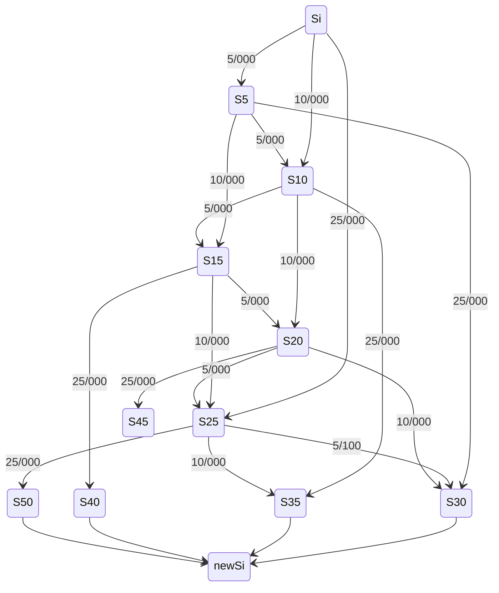
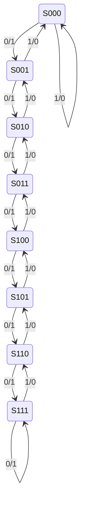
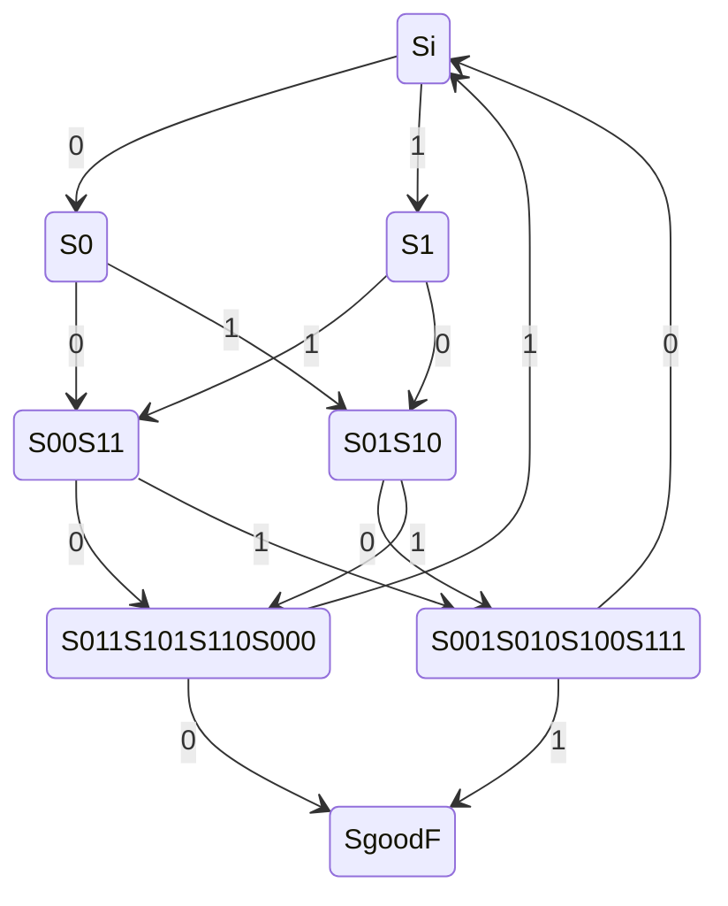

-1/+1

## Inputs

| Pin        | Size (in bits) | Explanation                                                  |
| ---------- | -------------- | ------------------------------------------------------------ |
| EnableIn   | 1              | Connect to the enable port of your registers/flip-flops. When 1 your circuit works normally. When 0 your circuit does nothing. |
| InputBitIn | 1              | The current bit being input into your circuit.               |
| ClkIn      | 1              | Connect this to the clock ports of your registers/flip-flops. Do nothing else with this. |

## Outputs

| Pin       | Size (in bits) | Explanation                                                  |
| --------- | -------------- | ------------------------------------------------------------ |
| IsEvenOut | 1              | 1 if there were an even number of 1’s in the last group of 4 bits and 0 otherwise. |

## Inputs

| Pin             | Size (in bits) | Explanation                                                  |
| --------------- | -------------- | ------------------------------------------------------------ |
| EnableIn        | 1              | Connect to the enable port of your registers/flip-flops. When 1 your circuit works normally. When 0 your circuit does nothing. |
| QuarterReceived | 1              | 1 if the user entered a quarter into the machine and 0 otherwise |
| DimeReceived    | 1              | 1 if the user entered a dime into the machine and 0 otherwise |
| NickelReceived  | 1              | 1 if the user entered a nickel into the machine and 0 otherwise |
| ClkIn           | 1              | Connect this to the clock ports of your registers/flip-flops. Do nothing else with this |

## Outputs

| Pin                  | Size (in bits) | Explanation                                                  |
| -------------------- | -------------- | ------------------------------------------------------------ |
| Give_Merchandise_Out | 1              | 1 if the user has entered 30 cents and 0 otherwise           |
| Give_Dime_Out        | 1              | 1 if a dime should be given back as change and 0 otherwise   |
| Give_Nickel_out      | 1              | 1 if a nickel should be given back as change and 0 otherwise |

```mermaid
graph TD;
  A((Total_Value=0, Change_Amount=0)) -->|QuarterReceived=1| B((Total_Value=25, Change_Amount=0))
  A -->|DimeReceived=1| C((Total_Value=10, Change_Amount=0))
  A -->|NickelReceived=1| D((Total_Value=5, Change_Amount=0))
  B -->|QuarterReceived=1| E((Total_Value=50, Change_Amount=0))
  B -->|DimeReceived=1| F((Total_Value=35, Change_Amount=0))
  B -->|NickelReceived=1| G((Total_Value=30, Change_Amount=0))
  C -->|QuarterReceived=1| H((Total_Value=35, Change_Amount=0))
  C -->|DimeReceived=1| I((Total_Value=20, Change_Amount=0))
  C -->|NickelReceived=1| J((Total_Value=15, Change_Amount=0))
  D -->|QuarterReceived=1| K((Total_Value=30, Change_Amount=5))
  D -->|DimeReceived=1| L((Total_Value=15, Change_Amount=5))
  D -->|NickelReceived=1| M((Total_Value=10, Change_Amount=5))
  E -->|QuarterReceived=1| N((Total_Value=75, Change_Amount=0))
  E -->|DimeReceived=1| O((Total_Value=60, Change_Amount=0))
  E -->|NickelReceived=1| P((Total_Value=55, Change_Amount=0))
  F -->|QuarterReceived=1| Q((Total_Value=60, Change_Amount=0))
  F -->|DimeReceived=1| R((Total_Value=45, Change_Amount=0))
  F -->|NickelReceived=1| S((Total_Value=40, Change_Amount=0))
  G -->|QuarterReceived=1| T((Total_Value=55, Change_Amount=0))
  G -->|DimeReceived=1| U((Total_Value=40, Change_Amount=0))
  G -->|NickelReceived=1| V((Total_Value=35, Change_Amount=0))
  H -->|QuarterReceived=1| W((Total_Value=60, Change_Amount=0))
  H -->|DimeReceived=1| X((Total_Value=45, Change_Amount=0))
  H -->|NickelReceived=1| Y((Total_Value=40, Change_Amount=0))
  I -->|QuarterReceived=1| Z((Total_Value=50, Change_Amount=0))
  I -->|DimeReceived=1| A1((Total_Value=30, Change_Amount=0))
  I -->|NickelReceived=1| B1((Total_Value=25, Change_Amount=0))
  J -->|QuarterReceived=1| C1((Total_Value=45, Change_Amount=0))
  J -->|DimeReceived=1| D1((Total_Value=25, Change_Amount=0))
  J -->|NickelReceived=1| E1((Total_Value=20, Change_Amount=0))
  K --> F1((Give_Merchandise_Out=1, Give_Dime_Out=1, Give_Nickel_Out=0))
  L --> G1((Give_Merchandise_Out=1, Give_Dime_Out=0, Give_Nickel_Out=1))
M --> H1((Give_Merchandise_Out=1, Give_Dime_Out=0, Give_Nickel_Out=1))
N --> I1((Give_Merchandise_Out=1, Give_Dime_Out=0, Give_Nickel_Out=0))
O --> J1((Give_Merchandise_Out=1, Give_Dime_Out=1, Give_Nickel_Out=0))
P --> K1((Give_Merchandise_Out=1, Give_Dime_Out=0, Give_Nickel_Out=1))
Q --> L1((Give_Merchandise_Out=1, Give_Dime_Out=0, Give_Nickel_Out=0))
R --> M1((Give_Merchandise_Out=1, Give_Dime_Out=1, Give_Nickel_Out=0))
S --> N1((Give_Merchandise_Out=1, Give_Dime_Out=0, Give_Nickel_Out=1))
T --> O1((Give_Merchandise_Out=1, Give_Dime_Out=0, Give_Nickel_Out=0))
U --> P1((Give_Merchandise_Out=1, Give_Dime_Out=1, Give_Nickel_Out=0))
V --> Q1((Give_Merchandise_Out=1, Give_Dime_Out=0, Give_Nickel_Out=1))
W --> R1((Give_Merchandise_Out=1, Give_Dime_Out=0, Give_Nickel_Out=0))
X --> S1((Give_Merchandise_Out=1, Give_Dime_Out=1, Give_Nickel_Out=0))
Y --> T1((Give_Merchandise_Out=1, Give_Dime_Out=0, Give_Nickel_Out=1))
Z --> U1((Give_Merchandise_Out=1, Give_Dime_Out=0, Give_Nickel_Out=0))
A1 --> V1((Give_Merchandise_Out=1, Give_Dime_Out=0, Give_Nickel_Out=0))
B1 --> W1((Give_Merchandise_Out=1, Give_Dime_Out=0, Give_Nickel_Out=1))
C1 --> X1((Give_Merchandise_Out=1, Give_Dime_Out=0, Give_Nickel_Out=0))
D1 --> Y1((Give_Merchandise_Out=1, Give_Dime_Out=1, Give_Nickel_Out=0))
E1 --> Z1((Give_Merchandise_Out=1, Give_Dime_Out=0, Give_Nickel_Out=1))

```

