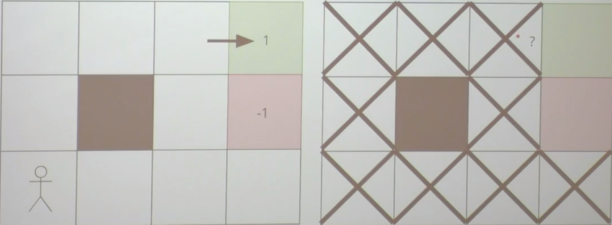
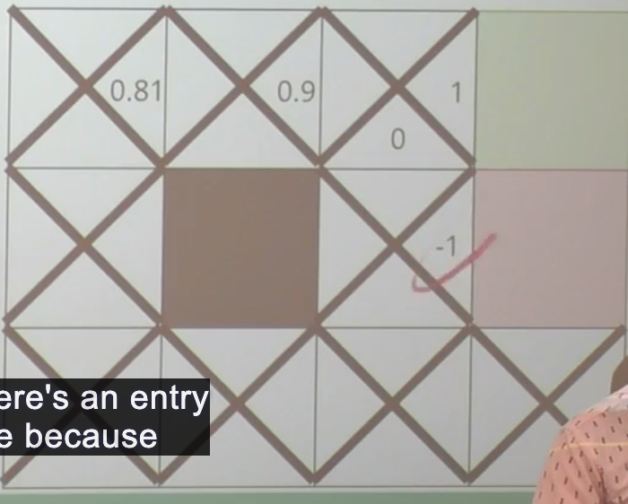
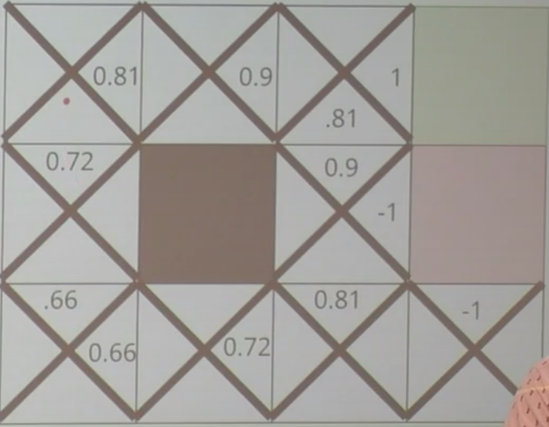
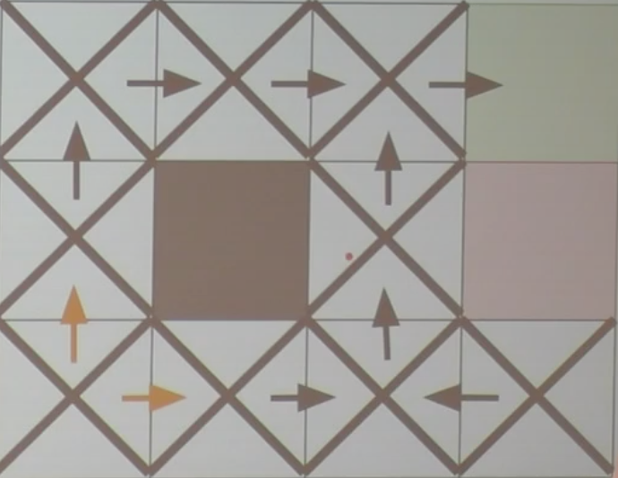
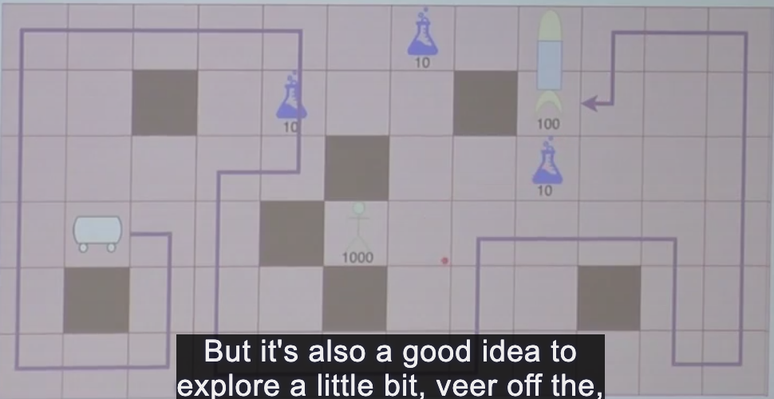
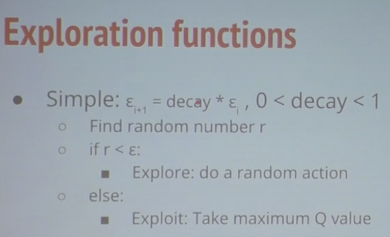
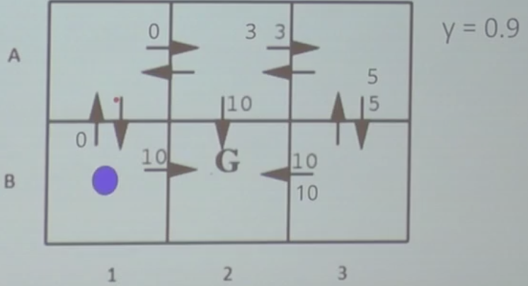
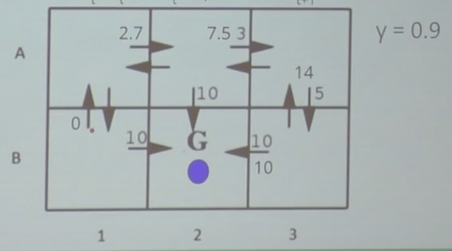
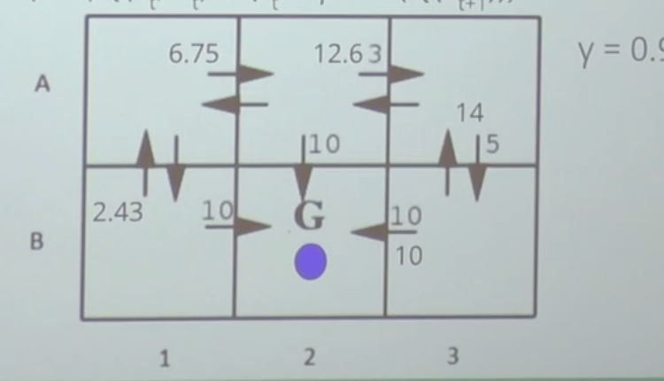
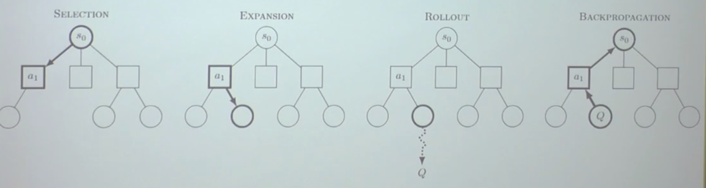

## ECS 170 8/18 Lecture

#### Reinfocerment Learning

##### Q-Learning vs. V-Learning

Q-Learning tries to find out the quality of different actions are each state.

We usually want to use Q-Learning as it makes fewer assumption about this problem. 

```pseudocode
Initialize Q(s,a) = 0 for all (s,a)
for each epoch:
	while not done:
		Select an action
		Apply action to environment
		Update the Q-Table
policy = argmax_a Q(S) for all s
```

Q-Update function: $Q(s_t,a_t) = r_t + \gamma max(Q(s_{t+1}))$

`Rt = immediate reward. gamma is the future reward`

###### Review

- PacMan
  - Action: ways that we can move (up, down, left, right)
  - States: walls, ghosts, pellets
  - Rewards: increase in score in every step
    - Punishment: when pacman touched the ghosts.
- Running man
  - States: positions of various joints. Information of the block
  - Rewards: if it travel forward
    - Punish: waste of time. Small $\gamma$
- Go
  - States: The board.
  - Actions: Placing pieces down
  - Rewards: +1 if we win/ -1 if we lose
    - We could include more algorithm: to compute more involved reward functions
    - Later version has simple reward system as computation power grow.

###### Review Q-Learning

- $\gamma = 0.9$

  

  - No immediate reward when he moves 1 step up.
  - Since there is no reward except termination, we will first get the green block to +1. 
  - We gone from the last block to +1 green block. The first update made at ? `1`
  - We go again  and we find out the block next to the new `1` (future reward) we know it's 0.9$1 * \gamma = 0.9$
  - The block next to the red block is -1
  - 1 -> 0.9 -> 0.81
  - This block is 下0 because this action we take the max of the next block

  - and the 上 become 0.9
  - We keep exploring and update Q-Table
  - Finally, take argmax and we know which way should we go

- 
  - We finally get a table like this and we could get the actions like this.
    - 
  - What if we want to stay as far as away from the red block (like lava) and keep closer to get to the green block?
    - Simpler options: We could add a little bit of probability that say we have 10% of probability going to random actions. (90% of the time we take correct route)

##### Q-Learning function

- Q' can be learned with the following
  - $Q(s_t, a_t) = r_t+\gamma max(Q(s_{t+1}))$
  - $$r_t$$: Reward for the action
  - $\gamma$: Discount
  - $max(Q(s_{t+1}))$: Reward for the future action
- Is this the same as $r_t+\gamma r_{t+1}+\gamma ^2r_{t+2}+...$
  - They are identical.

##### BlackJack Example  

##### introducing alpha $\alpha$

- What deficiency in our Q-table that doesn't seem doing well?
  -  Q-table has hard updates. In stochastic environment this isn't something that we should get. Because we shouldn't throwing out everything before. We are instant forgetting everything we learned before.
  - alpha $\alpha$ learning rate
    - $$Q(s_t, a_t) = (1-a)Q(s_t)+\alpha (r_t + \gamma max(Q(s_{t+1})))$$
    - Keep old knowledge and add knowledge more gradually
  - alpha could be 0 and 1
    - When alpha = 1:
      - Hard updates - learning quickly = regular function
    - When alpha = 0
      - No learning
  - Can dynamically change alpha:
    - $1/(visits(s,a))$
    - Decay alpha with time.

##### Limitations of what we learned so far

- What if we have a larger states / big problems?
- How do we chose an action while learning?
- Learning is too specific

######  Bootstrapping / Seeding

- Initialize policy based off our own knowledge, so that we could speed up the training
  - Blackjack
    - Hitting at 10 or less is always a good idea
  - Connect 4
    - Preference on working in the middle

- Dangerous in Bootstrapping
  - It assumes that what we know about the problem is correct
  - But for a lot of the problem, maybe human is not always right.

##### Exploration vs Exploitation

##### epsilon $\epsilon$ 

- 

- Sometimes we should explore the states

- In the beginning, we know nothing, pure exploration

- As we learn, more exploitation

  Exploration term - $\epsilon$ 

  - Algorithm:
    - Draw random number, if >$\epsilon$ exploit, otherwise explore
    - Decrement $\epsilon$ after each training episode
    - 

  - State-by-state

    $\epsilon_{s,a} = Q(s,a) + k/(n+1)$

    - K is an exploration constant, n is number of times we have visited that action
    - Take action a with largest $\epsilon_{s,a}$ at state s
    - As an action looks better, we exploit more
    - The more times we look at an action, the more we explore something else.

##### Different Perspectives on Q-Learning

- Dynamic programming
  - Break big problem up into subproblems
  - solve subproblems optimally
  - construct an optimal solution based on optimal subproblems
- "Analogous" to psychology
  - pavlovian conditioning
    - Positive feedback to encourage actions
    - Negative feedback to discourage actions

##### Proof of Optimality - A unique circumstance

- Q' monotonically improves
- Q' never overestimates Q
- Formally: $\lim_{n\to\infty} Q'=Q $
- $\Delta n = max_{s,a} |Q_n'(s,a) - Q(s,a)|$
  - biggest mistake after n epochs
- $\Delta _{n+1} \le \gamma \Delta_n$
- $\Delta _{n+1} \le \gamma^i \Delta_n$

 Assumption?

- Infinite training
- Dynamic learning rate
- We visit every state-action pair on each training epoch


## ECS 170 8/23 Lecture (Review)

`Numpy, PyTorch, TensorFlow` put on your resume

- Review: Q-Learning
  - Maximize cumultive discounted

  - $r_t+\gamma r_{t+1}+\gamma ^2r_{t+2}...$

  - We can write it as
    - $Q(s_t,a_t) = r_t+\gamma max(Q(s_{t+1}))$
    - Keep it as a table
    
  - Update: $$Q(s_t,a_t) = (1-\alpha)Q(s_t,a_t)+\alpha (r_t+\gamma max(Q(s_{t+1})))$$

  - Episode 1
    - 


  - Episode 2
    - 
  - Episode 3
    - 

- Applications

  - Q-Learning lays the groundwork for **deep-Q learning**
  - Deep Q-Learning was popularized in 2014 when it demonstrated that it could play Atari games at expert levels
  - People not using regular Q-Learning so much anymore.

- Our Case Studies

  How could we formulate hummingbirds as a series of states, actions and rewards?

  - States: ~~information of the game world~~
    - State: Ray cast 光线投射 simulate looking forward
  - Actions: hummingbirds move in x,y,z directions
  - Reward: if it drinking nectar, it is a positive reward
    - Negative reward: penalty on however long it takes to find / out of bounds penalty

  Is Q-Learning enough for this?

  - No, we are in continuous world, not in discrete world

  How about Alpha-Go

  - Issue: state action space is huge, even we add a lot of computing power.

##### Recall: Monte Carlo Tree Search

- Selection, Expansion, Rollout, Backpropagation
  - 

- Random games are not very useful when we play Go.
- Selection and expansion space is not looking helpful.
- We will use V-Learning to select a node and expand.
  - We can make deterministic function for Go.
- Rollout: Q-Learner plays a game

##### AlphaGo

- Combination of everything we learned so far
- Missing?
  - Problem is too large for Q & V learning
  - Need some way to generalize our learning...


